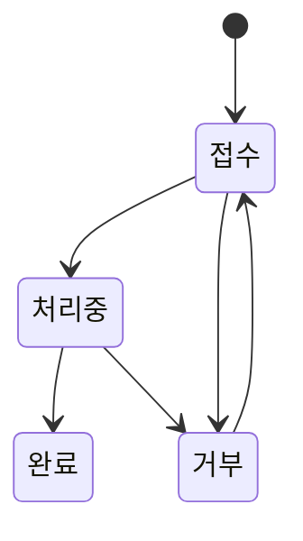
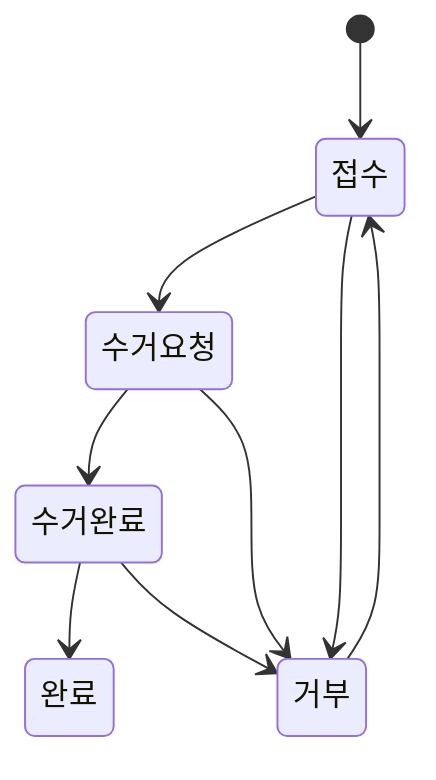
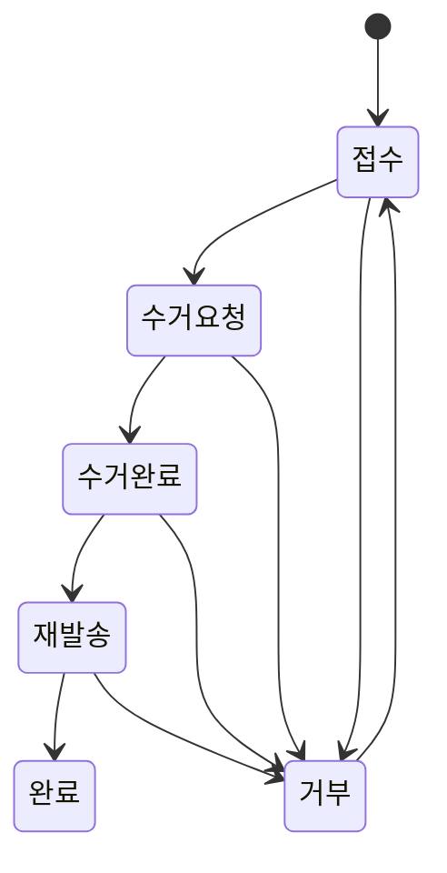

# Claim (취소 / 반품 / 교환)

주문 후 고객이 취소·반품·교환을 요청하는 프로세스. 클레임은 orders 테이블에 연결된 주문에 대해서만 생성 가능하며, quote-request와 design-token은 클레임 시스템 밖이다.

## 경계

| 구분      | 내용                                                                                                                                                                                  |
| --------- | ------------------------------------------------------------------------------------------------------------------------------------------------------------------------------------- |
| Always do | 클레임 생성 가능 여부는 프론트 `CLAIM_ACTIONS_BY_STATUS`에서 제어. 거부 → 접수 복원은 항상 허용(오거부 복원). `create_claim` RPC는 주문 상태를 검증하지 않으므로 프론트 UI 제어 필수. |
| Ask first | 클레임 가능 주문 상태 범위 확대. 수거완료/재발송/완료 이후 추가 전이 허용.                                                                                                            |
| Never do  | 수거완료/재발송/완료 상태에서 롤백. quote-request/design-token에 클레임 생성. 클레임 생성 시 주문 상태 서버 검증 없이 진행 가정.                                                      |

## 상태 전이

### 상태값

**cancel 전용**

| 상태   | 설명                       |
| ------ | -------------------------- |
| 접수   | 고객이 취소 요청 제출      |
| 처리중 | 관리자가 취소 처리 진행 중 |
| 완료   | 취소 처리 완료             |
| 거부   | 관리자가 취소 거부         |

**return / exchange 공통**

| 상태     | 설명                       |
| -------- | -------------------------- |
| 접수     | 고객이 반품/교환 요청 제출 |
| 수거요청 | 관리자가 수거 요청 진행    |
| 수거완료 | 수거 완료 (롤백 불가 지점) |
| 완료     | 최종 처리 완료             |
| 거부     | 관리자가 반품/교환 거부    |

**exchange 전용 추가**

| 상태   | 설명                                 |
| ------ | ------------------------------------ |
| 재발송 | 교환 상품 재발송 중 (롤백 불가 지점) |

### cancel 상태 다이어그램



### return 상태 다이어그램



### exchange 상태 다이어그램



## 순방향 전이

### cancel 순방향

| 현재 상태 | 다음 상태 | 조건                  |
| --------- | --------- | --------------------- |
| 접수      | 처리중    | 관리자 처리 시작      |
| 처리중    | 완료      | 관리자 취소 처리 완료 |
| 접수      | 거부      | 관리자 거부 처리      |
| 처리중    | 거부      | 관리자 거부 처리      |

### return 순방향

| 현재 상태 | 다음 상태 | 조건                |
| --------- | --------- | ------------------- |
| 접수      | 수거요청  | 관리자 수거 요청    |
| 수거요청  | 수거완료  | 수거 완료 확인      |
| 수거완료  | 완료      | 최종 반품 완료 처리 |
| 접수      | 거부      | 관리자 거부 처리    |
| 수거요청  | 거부      | 관리자 거부 처리    |
| 수거완료  | 거부      | 관리자 거부 처리    |

### exchange 순방향

| 현재 상태 | 다음 상태 | 조건                  |
| --------- | --------- | --------------------- |
| 접수      | 수거요청  | 관리자 수거 요청      |
| 수거요청  | 수거완료  | 수거 완료 확인        |
| 수거완료  | 재발송    | 교환 상품 재발송 시작 |
| 재발송    | 완료      | 재발송 완료 확인      |
| 접수      | 거부      | 관리자 거부 처리      |
| 수거요청  | 거부      | 관리자 거부 처리      |
| 수거완료  | 거부      | 관리자 거부 처리      |
| 재발송    | 거부      | 관리자 거부 처리      |

## 롤백 전이

| 클레임 타입 | 현재 상태 → 이전 상태 | 조건                    |
| ----------- | --------------------- | ----------------------- |
| cancel      | 처리중 → 접수         | memo 필수               |
| return      | 수거요청 → 접수       | memo 필수               |
| exchange    | 수거요청 → 접수       | memo 필수               |
| 모든 타입   | 거부 → 접수           | 항상 가능 (오거부 복원) |

> 수거완료, 재발송, 완료 상태는 `is_rollback=true`여도 이전 상태 복원 불가.

## 전이 불가

| 상태     | 사유                                                       |
| -------- | ---------------------------------------------------------- |
| 수거완료 | 물리적 수거 완료 후 되돌릴 수 없음. is_rollback 여부 무관. |
| 재발송   | 재발송 시작 후 되돌릴 수 없음. is_rollback 여부 무관.      |
| 완료     | 최종 종료 상태. 이후 전이 없음.                            |

## 비즈니스 규칙

- **BR-claim-001**: 클레임 생성 가능 여부는 프론트 `CLAIM_ACTIONS_BY_STATUS`에서만 제어. `create_claim` RPC는 주문 상태 미검증.
- **BR-claim-002**: `sale` 주문 — 대기중/진행중: cancel. 배송중/배송완료: return/exchange. 완료: 없음.
- **BR-claim-003**: `repair` 주문 — 대기중: cancel. 발송대기/발송중: cancel (미구현). 배송중/배송완료: return/exchange.
- **BR-claim-004**: `custom` 주문 — 대기중: cancel. 접수/제작중/샘플 단계: cancel (미구현). 배송중/배송완료: return/exchange.
- **BR-claim-005**: 거부 → 접수 복원은 항상 가능 (오거부 복원 목적).
- **BR-claim-006**: 수거완료/재발송/완료는 `is_rollback` 여부 무관하게 이전 상태 복원 불가.
- **BR-claim-007**: 반품/교환은 배송중/배송완료 주문 상태에서만 신청 가능. 완료 상태에서 불가.
- **BR-claim-008**: 클레임 이유 코드: `change_mind` / `defect` / `delay` / `wrong_item` / `size_mismatch` / `color_mismatch` / `other`.
- **BR-claim-009**: quote-request와 design-token은 클레임 시스템 외부. 각자 별도 종료/환불 메커니즘 사용.

  **quote-request 종료**: `admin_update_quote_request_status` RPC로 관리자가 직접 `종료` 상태 전환. 클레임 미생성.

  **design-token 환불 경로 (2가지)**:

  | 상황             | 처리 방법                                                                                        |
  | ---------------- | ------------------------------------------------------------------------------------------------ |
  | Toss 결제 실패   | `unlock_token_payment` RPC — `결제중` → `대기중`, 토큰 미지급                                    |
  | AI 이미지 미생성 | `refund_design_tokens` RPC — 선차감 토큰 복원, `work_id` 기반 멱등, Edge Function 내부 자동 호출 |

## 화면 및 진입점

| 앱    | 경로                                  | 설명                                                            |
| ----- | ------------------------------------- | --------------------------------------------------------------- |
| store | `/order/claim/:type/:orderId/:itemId` | 클레임 신청 폼 (`ClaimFormPage`)                                |
| store | `/order/claim-list`                   | 클레임 목록                                                     |
| store | `/order/claim-detail/:claimId`        | 클레임 상세 (`ClaimDetailPage`, 읽기 전용, 접수 취소 버튼 포함) |
| admin | `/claims`                             | 클레임 목록                                                     |
| admin | `/claims/show/:claimId`               | 클레임 상세 및 상태 변경                                        |

## API 호출 흐름

```
프론트 (클레임 신청)
  └─ create_claim RPC 호출 (claim_type, order_id, item_id, reason_code, reason_detail)
  └─ 결과: 클레임 레코드 생성 (초기 상태: 접수)

프론트 (클레임 취소 — 접수 상태만)
  └─ cancel_claim RPC 호출 (p_claim_id)
  └─ RPC 내부: 소유권·상태 검증 → claims 레코드 삭제 → claim_status_logs CASCADE 삭제
  └─ token_refund 타입은 직접 취소 불가

프론트 (admin 상태 변경)
  └─ update_claim_status RPC 호출 (claim_id, next_status, is_rollback, memo)
  └─ RPC 내부: 허용 전이 검증 → 상태 업데이트 → 이력 기록
```

## 관련 파일

| 파일                                                  | 설명                                                                    |
| ----------------------------------------------------- | ----------------------------------------------------------------------- |
| `supabase/schemas/94_functions_claims.sql`            | 클레임 RPC 전체 (`create_claim`, `update_claim_status`, `cancel_claim`) |
| `packages/shared/src/constants/claim-status.ts`       | 클레임 상태 상수                                                        |
| `packages/shared/src/constants/claim-actions.ts`      | 클레임 액션 상수                                                        |
| `apps/store/src/features/claim/claim-detail/page.tsx` | 클레임 상세 페이지 (읽기 전용)                                          |
| `apps/store/src/features/claim/api/claims-api.ts`     | `getClaim`, `cancelClaim` 포함                                          |

## 횡단 참조

- [[sale]] — sale 주문의 클레임 가능 상태 범위
- [[repair]] — repair 주문의 클레임 가능 상태 범위
- [[custom-order]] — custom 주문의 클레임 가능 상태 범위 (일부 미구현)

## 미결 사항

- repair 주문의 발송대기/발송중 단계에서 cancel 클레임 처리 미구현 (BR-claim-003)
- custom 주문의 접수/제작중/샘플 단계에서 cancel 클레임 처리 미구현 (BR-claim-004)
- `create_claim` RPC에 주문 상태 서버 검증 추가 여부 검토 필요 (현재 프론트 UI 제어에만 의존)
