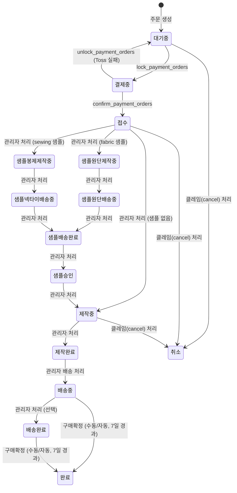

# Custom Order (주문 제작)

> 고객이 주문제작 마법사를 통해 넥타이 옵션(원단, 봉제 옵션 등)을 직접 선택해 맞춤 제작을 의뢰하는 주문 흐름. 별도 Edge Function(`create-custom-order`)으로 생성되며 일반 장바구니를 경유하지 않는다.

## 경계

| 구분      | 규칙                                                                                                                                           |
| --------- | ---------------------------------------------------------------------------------------------------------------------------------------------- |
| Always do | 금액 계산은 `calculate_custom_order_amounts` RPC에서만 수행. 주문 제작은 별도 `create-custom-order` Edge Function 사용 (일반 장바구니 미경유). |
| Ask first | 샘플 단계 **[미구현]** 상태 활성화. 취소 환불 비율 변경.                                                                                       |
| Never do  | `배송중` 이후 상태에서 취소. `배송중` 이후 상태에서 롤백. 프론트에서 옵션 가격 계산. `dimple`/`spoderato`/`fold7` 중복 선택 허용.              |

## 상태 전이



### 상태값

| 상태               | 설명                                   |
| ------------------ | -------------------------------------- |
| `대기중`           | 주문 생성 직후, 결제 대기              |
| `결제중`           | Toss 결제 게이트웨이 호출 전 잠금 상태 |
| `접수`             | 결제 확정 완료, 제작 시작 대기         |
| `샘플원단제작중`   | 원단 샘플 제작 중                      |
| `샘플원단배송중`   | 원단 샘플 배송 중                      |
| `샘플봉제제작중`   | 봉제 샘플 제작 중                      |
| `샘플넥타이배송중` | 봉제 샘플 배송 중                      |
| `샘플배송완료`     | 샘플 배송 완료, 고객 승인 대기         |
| `샘플승인`         | 고객 샘플 승인 완료                    |
| `제작중`           | 본 제작 작업 진행 중                   |
| `제작완료`         | 제작 완료, 배송 준비                   |
| `배송중`           | 배송 시작                              |
| `배송완료`         | 배송 완료, 구매확정 대기               |
| `완료`             | 구매확정 완료                          |
| `취소`             | 주문 취소                              |

### 순방향

| 현재 상태          | 다음 상태          | 트리거                                                 |
| ------------------ | ------------------ | ------------------------------------------------------ |
| `대기중`           | `결제중`           | `lock_payment_orders`                                  |
| `결제중`           | `접수`             | `confirm_payment_orders`                               |
| `결제중`           | `대기중`           | `unlock_payment_orders` (Toss 실패)                    |
| `접수`             | `제작중`           | 관리자 처리 (샘플 없음)                                |
| `접수`             | `샘플원단제작중`   | 관리자 처리 (fabric 샘플)                              |
| `접수`             | `샘플봉제제작중`   | 관리자 처리 (sewing 샘플)                              |
| `샘플원단제작중`   | `샘플원단배송중`   | 관리자 처리                                            |
| `샘플원단배송중`   | `샘플배송완료`     | 관리자 처리                                            |
| `샘플봉제제작중`   | `샘플넥타이배송중` | 관리자 처리                                            |
| `샘플넥타이배송중` | `샘플배송완료`     | 관리자 처리                                            |
| `샘플배송완료`     | `샘플승인`         | 관리자 처리                                            |
| `샘플승인`         | `제작중`           | 관리자 처리                                            |
| `제작중`           | `제작완료`         | 관리자 처리                                            |
| `제작완료`         | `배송중`           | 관리자 배송 처리                                       |
| `배송중`           | `배송완료`         | 관리자 상태 변경 (선택적, 거의 사용 안 함)             |
| `배송중`           | `완료`             | 구매확정 (수동) 또는 shipped_at 기준 7일 경과 (자동)   |
| `배송완료`         | `완료`             | 구매확정 (수동) 또는 delivered_at 기준 7일 경과 (자동) |

**샘플 타입별 분기**

| 샘플 타입           | 접수 이후 단계                                                              |
| ------------------- | --------------------------------------------------------------------------- |
| 없음                | 접수 → 제작중                                                               |
| `sewing`            | 접수 → 샘플봉제제작중 → 샘플넥타이배송중 → 샘플배송완료 → 샘플승인 → 제작중 |
| `fabric`            | 접수 → 샘플원단제작중 → 샘플원단배송중 → 샘플배송완료 → 샘플승인 → 제작중   |
| `fabric_and_sewing` | fabric + sewing 플로우 합산                                                 |

### 롤백

`is_rollback=true` + `memo`(사유) 필수. 오입력 정정 목적으로만 사용한다.

| 현재 상태  | 롤백 대상 | 조건                        |
| ---------- | --------- | --------------------------- |
| `접수`     | `대기중`  | is_rollback=true, memo 필수 |
| `제작중`   | `접수`    | is_rollback=true, memo 필수 |
| `제작완료` | `제작중`  | is_rollback=true, memo 필수 |

### 전이 불가

| 상태                 | 불가 동작      | 이유                   |
| -------------------- | -------------- | ---------------------- |
| `배송중`             | 이전 상태 복원 | 배송 시작 후 롤백 불가 |
| `배송완료`           | 이전 상태 복원 | 배송 완료 후 롤백 불가 |
| `완료`               | 이전 상태 복원 | 구매확정 후 롤백 불가  |
| `취소`               | 이전 상태 복원 | 취소 확정 후 롤백 불가 |
| `배송중`             | 취소           | 배송 시작 후 취소 불가 |
| `배송완료`           | 취소           | 배송 완료 후 취소 불가 |
| `완료`               | 취소           | 구매확정 후 취소 불가  |
| `제작완료` 이후 전체 | 취소           | 제작 완료 후 취소 불가 |

## 비즈니스 규칙

1. **BR-custom-001**: 결제 완료 시 `결제중` → `접수`로 전이
2. **BR-custom-002**: Toss 결제 실패 시 `결제중` → `대기중` 자동 복구
3. **BR-custom-003**: 롤백 가능 상태: `접수` → `대기중`, `제작중` → `접수`, `제작완료` → `제작중`. memo 필수
4. **BR-custom-004**: `배송중`/`배송완료`/`완료`/`취소`는 롤백 불가
5. **BR-custom-005**: `제작완료` 이후(`제작완료`, `배송중`, `배송완료`, `완료`) 취소 불가
6. **BR-custom-006**: 취소 환불 규칙 — `대기중`/`접수`: 전액 환불. 샘플 단계(`샘플원단제작중`~`샘플승인`): `sample_cost` 공제 후 환불. `제작중`(샘플 있음): `sample_cost` 공제 후 환불
7. **BR-custom-007**: 금액 계산은 `calculate_custom_order_amounts` RPC에서만 수행. 봉제비 상수는 `custom_order_pricing_constants` 테이블. 원단 단가는 `custom_order_fabric_prices` 테이블
8. **BR-custom-008**: `dimple`/`spoderato`/`fold7` 중 최대 1개만 선택 가능 (상호배타적)
9. **BR-custom-009**: `dimple` 옵션은 `tie_type=AUTO`일 때만 선택 가능
10. **BR-custom-010**: 샘플 단계 분기 — `fabric`: `접수 → 샘플원단제작중 → 샘플원단배송중 → 샘플배송완료 → 샘플승인 → 제작중`. `sewing`: `접수 → 샘플봉제제작중 → 샘플넥타이배송중 → 샘플배송완료 → 샘플승인 → 제작중`

## 화면 및 진입점

| 앱    | 화면            | 경로                  | 관련 상태 |
| ----- | --------------- | --------------------- | --------- |
| store | 주문제작 마법사 | /custom-order         | 대기중    |
| store | 주문 목록       | /order/order-list     | 전체 상태 |
| store | 주문 상세       | /order/:orderId       | 전체 상태 |
| admin | 주문 목록       | /orders?tab=custom    | 전체 상태 |
| admin | 주문 상세       | /orders/show/:orderId | 전체 상태 |

**진입점**

- store `/custom-order` → 마법사 (수량 → 원단 → 봉제 → 스펙 → 마무리 → 샘플 → 첨부 → 확인) → 결제 → 주문 상세

## API 호출 흐름

### 주문 제작 생성

```text
프론트 → Edge Function: create-custom-order
  └─ 마법사 입력값 (원단, 봉제 옵션, 샘플 타입 등) 전달
  └─ RPC: calculate_custom_order_amounts (금액 계산)
  └─ RPC: create_custom_order_txn
       └─ orders(custom) 생성
  └─ 반환: { payment_group_id, total_amount, order_id }
```

### 결제

```text
프론트 → Toss SDK 결제 UI
프론트 → Edge Function: confirm-payment
  └─ RPC: lock_payment_orders (대기중 → 결제중)
  └─ Toss API: /v1/payments/confirm
  └─ 성공: RPC: confirm_payment_orders (결제중 → 접수)
  └─ 실패: RPC: unlock_payment_orders (결제중 → 대기중)
```

결제 정책 상세는 [[payment]] 참조.

## 가격 계산 규칙

### 봉제비 (Sewing Cost)

| 옵션          | 상수명             | 설명                             |
| ------------- | ------------------ | -------------------------------- |
| 기본 제작비   | `START_COST`       | 건당 고정 기본비                 |
| 기본 봉제비   | `SEWING_PER_COST`  | 수량 단위 봉제비                 |
| 자동 넥타이   | `AUTO_TIE_COST`    | 추가 비용                        |
| 삼각 스티치   | `TRIANGLE_STITCH`  | 옵션 추가비                      |
| 사이드 스티치 | `SIDE_STITCH`      | 옵션 추가비                      |
| 바택          | `BAR_TACK`         | 옵션 추가비                      |
| 딤플          | `DIMPLE`           | 옵션 추가비 (tie_type=AUTO 전용) |
| 스포데라토    | `SPODERATO`        | 옵션 추가비                      |
| 폴드7         | `FOLD7`            | 옵션 추가비                      |
| 울 심지       | `WOOL_INTERLINING` | 옵션 추가비                      |
| 브랜드 라벨   | `BRAND_LABEL`      | 옵션 추가비                      |
| 케어 라벨     | `CARE_LABEL`       | 옵션 추가비                      |

**상호배타적 옵션**: `dimple`, `spoderato`, `fold7` 중 최대 1개만 선택 가능.

### 원단비 (Fabric Cost)

| 조건             | 비용                                           |
| ---------------- | ---------------------------------------------- |
| 고객 제공 원단   | 0원                                            |
| 매장 원단 선택   | `design_type + fabric_type` 조합으로 단가 조회 |
| YARN_DYED 디자인 | 추가 비용 발생                                 |

원단 단가는 `public.custom_order_fabric_prices` 테이블에서 조회한다. 봉제비 상수는 `public.custom_order_pricing_constants` 테이블에서 관리된다.

## 관련 파일

| 파일                                              | 역할                                                        |
| ------------------------------------------------- | ----------------------------------------------------------- |
| `supabase/schemas/95_functions_custom_orders.sql` | `create_custom_order_txn`, `calculate_custom_order_amounts` |
| `supabase/functions/create-custom-order/index.ts` | 주문 제작 생성 Edge Function                                |
| `supabase/functions/confirm-payment/index.ts`     | 결제 확정 Edge Function                                     |
| `packages/shared/src/constants/order-status.ts`   | 상태 상수 정의                                              |

## 횡단 참조

- [[payment]] — 결제 흐름, Toss 연동, 환불 정책
- [[claim]] — 취소/반품/교환 클레임 처리

## 미결 사항

<!-- QA 중 버그인지 기획 변경인지 애매한 항목을 여기에 기록 -->
<!-- 형식: - [ ] 항목 설명 (발견일, 관련 화면) -->
