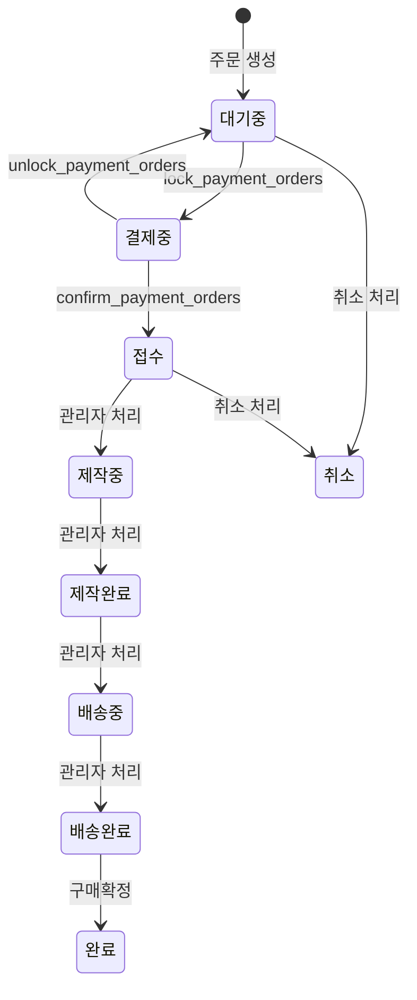

# Custom Order (주문 제작)

> 주문제작은 샘플 주문과 분리된 독립 주문 도메인이다. store `/custom-order`에서 생성되고 `/order/custom-payment`에서 결제를 진행하며, `order_type='custom'`만 사용한다.

## 경계

| 구분      | 규칙                                                                                                                          |
| --------- | ----------------------------------------------------------------------------------------------------------------------------- |
| Always do | 금액 계산은 `calculate_custom_order_amounts` RPC에서만 수행한다. 생성은 `create-custom-order` Edge Function을 사용한다.       |
| Never do  | custom 주문에 샘플 상태를 다시 추가하지 않는다. `배송중` 이후 취소/롤백을 허용하지 않는다. 프론트에서 금액을 계산하지 않는다. |

- 사용자 진입: `/custom-order`
- 결제 경로: `/order/custom-payment`
- 결제 성공 처리: `/order/payment/success`에서 승인 확인 후 custom 주문이면 주문 상세 또는 주문 목록으로 이동한다

## 상태 전이

### 롤백

- `접수 -> 대기중`
- `제작중 -> 접수`
- `제작완료 -> 제작중`
- 공통 조건: `is_rollback=true`, `memo` 필수

### 전이 불가

- `제작중` 취소 불가
- `배송중`, `배송완료`, `완료`, `취소` 롤백 불가
- `제작완료` 이후 취소 불가

## 비즈니스 규칙

1. 결제 확정 시 `결제중 -> 접수`로 전이한다.
2. 주문제작은 주문 단위 쿠폰 1개를 적용할 수 있다.
3. 쿠폰을 적용해 주문을 생성하면 `user_coupons.status`는 `reserved`가 되고, 결제 확정 시 `used`, 결제 실패 또는 취소 시 `active`로 복원된다.
4. 샘플 제작은 [[sample]] 도메인에서만 처리한다. custom 주문은 샘플 파라미터를 받지 않는다.
5. `sample_cost`는 custom 주문에서 사용하지 않으며 항상 0이다.
6. 환불은 `대기중/결제중/접수`에서만 전액 환불 가능하다.

## 관련 파일

- `supabase/schemas/95_functions_custom_orders.sql`
- `supabase/functions/create-custom-order/index.ts`
- `apps/store/src/pages/order/custom-payment.tsx`
- `apps/store/src/pages/payment/success.tsx`
- `packages/shared/src/constants/order-status.ts`
- `apps/store/src/features/custom-order/`
- `apps/admin/src/features/orders/`

## 횡단 참조

- [[sample]]
- [[payment]]
- [[claim]]
