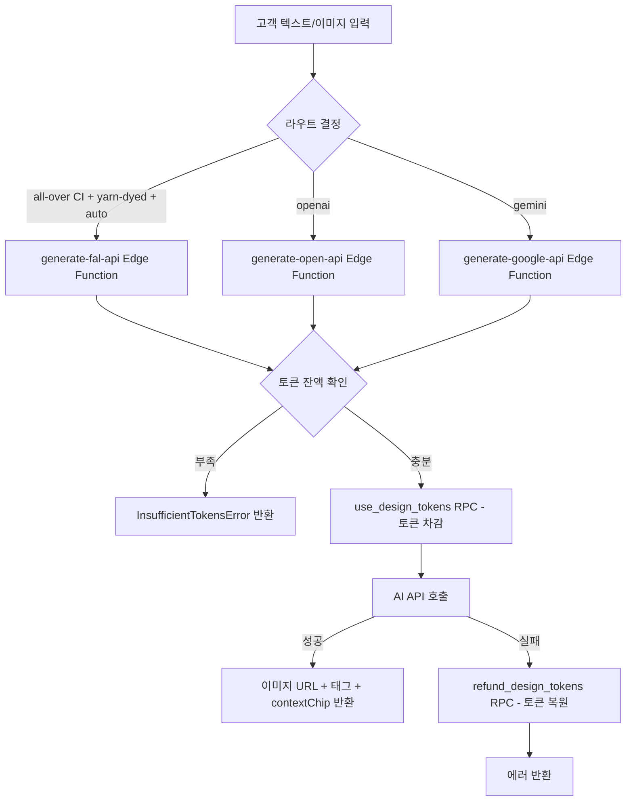

# Design (AI 디자인 생성)

고객이 텍스트 또는 이미지를 입력하면 AI 모델이 넥타이 디자인을 생성하는 단발성 프로세스. 별도 상태 전이 없이 요청→생성→완료(또는 실패)로 즉시 종료. 생성 비용은 요청 시 토큰으로 선차감되며, 이미지 미생성 시 차감된 토큰을 복원한다.

## 경계

| 구분      | 내용                                                                                                                                                       |
| --------- | ---------------------------------------------------------------------------------------------------------------------------------------------------------- |
| Always do | 토큰 차감 전 잔액 확인. `token_refund`가 접수 상태인 동안 생성 요청 차단. paid 토큰 먼저 차감 후 bonus 차감. work_id 기반 멱등 처리로 중복 토큰 복원 방지. |
| Ask first | 토큰 비용 변경. bonus 토큰 환불 허용.                                                                                                                      |
| Never do  | bonus 토큰 수동 환불 허용. 동일 주문 환불 중복 신청 허용. text_only에 high 품질 적용. 프론트에서 토큰 잔액 계산.                                           |

## 상태 전이

없음. 단발성 프로세스로 상태 머신이 존재하지 않는다.

### 생성 프로세스 흐름



## 토큰 유형

| 유형  | 취득 방법                  | 환불 가능 여부             |
| ----- | -------------------------- | -------------------------- |
| paid  | 토큰 구매로 획득           | 가능 (고객 수동 환불 신청) |
| bonus | 신규 가입 지급 또는 이벤트 | 불가                       |

## AI 모델별 Edge Function

| 모델   | Edge Function         | 지원 입력       | 비고                                               |
| ------ | --------------------- | --------------- | -------------------------------------------------- |
| openai | `generate-open-api`   | 텍스트 / 이미지 |                                                    |
| gemini | `generate-google-api` | 텍스트 / 이미지 |                                                    |
| fal    | `generate-fal-api`    | 텍스트 / 이미지 | all-over CI + yarn-dyed + auto 조건일 때 자동 선택 |

## 비즈니스 규칙

- **BR-design-001**: 토큰 차감 순서 — paid 먼저 차감, 이후 bonus 차감.
- **BR-design-002**: `token_refund`가 접수 상태인 동안에는 토큰 사용 불가.
- **BR-design-003**: `text_only`는 high 품질 미지원.
- **BR-design-004**: 이미지 미생성 시(데이터 부족 또는 텍스트 전용 응답) 선차감된 토큰을 `refund_design_tokens` RPC로 복원. `work_id` 기반 멱등 처리로 중복 복원 방지.
- **BR-design-005**: paid 토큰 미사용분은 전자거래 규정에 따라 고객이 수동 환불 신청 가능. bonus 불가.
- **BR-design-006**: 동일 주문에 `접수` 또는 `완료` 상태의 `token_refund`가 있으면 중복 신청 불가.
- **BR-design-007**: 신규 가입 시 bonus 토큰 30개 자동 지급.
- **BR-design-008**: 토큰 비용은 `admin_settings`에서 모델×요청 타입 조합으로 관리한다. 기본 요청 타입은 `analysis`, `prep`, `render_standard`, `render_high`이며, `prep`은 부적합 이미지의 OpenAI 패턴 보정이 실제 실행된 경우에만 별도 차감된다.
- **BR-design-009**: 멀티턴 대화 지원 — 프론트에서 `conversation_history` 유지해 이전 맥락 Edge Function에 전달.
- **BR-design-010**: `ciPlacement === "one-point"` 요청 시 첫 번째 색상으로 `solid` backgroundPattern을 자동 생성해 payload에 주입한다. 프롬프트에 배경 패턴 명세로 반영되어 AI가 다른 배경을 임의로 생성하지 않도록 제한한다.
- **BR-design-011**: AI 응답의 `detectedDesign`에 `positionIntent`("move-left" | "move-right" | "move-up" | "move-down") 필드 포함. 모티프 위치 이동 요청을 감지해 후속 생성에 반영한다.

## 화면 및 진입점

| 앱    | 경로                     | 설명        |
| ----- | ------------------------ | ----------- |
| store | `/design`                | 디자인 생성 |
| store | `/my-page/token-history` | 토큰 내역   |

## API 호출 흐름

```
프론트 → ai-design-api.ts
  └─ 참조 이미지를 Base64로 변환
  └─ shouldUseFalPipeline 판정 (all-over CI + yarn-dyed + auto 조건)
  └─ one-point CI 배치 시 solid backgroundPattern 자동 생성
  └─ Edge Function 선택
       ├─ fal 조건 충족 → generate-fal-api  (타일링/업스케일/IP-어댑터)
          referenceImageBase64만 있고 ciImageBase64는 없으면 A2(IP-Adapter) 분기로, 그 외 all-over CI 반복 렌더는 타일링 img2img 분기로 처리
       ├─ openai → generate-open-api
       └─ gemini → generate-google-api
  └─ Edge Function 호출 (메시지 / 디자인 컨텍스트 / 대화 히스토리 / 첨부 파일 / backgroundPattern)
  └─ 응답 파싱 (AI 메시지 / 이미지 URL / 태그 / contextChip / positionIntent)
  └─ RPC: get_design_token_balance (업데이트된 잔액 조회)
```

## 관련 파일

| 파일                                                            | 설명                                                     |
| --------------------------------------------------------------- | -------------------------------------------------------- |
| `apps/store/src/entities/design/api/ai-design-api.ts`           | 프론트 AI 디자인 API 레이어                              |
| `apps/store/src/entities/design/api/ai-design-mapper.ts`        | Edge Function 호출 payload 빌더 (backgroundPattern 포함) |
| `apps/store/src/entities/design/api/should-use-fal-pipeline.ts` | Fal 파이프라인 라우팅 판정 로직                          |
| `supabase/functions/generate-fal-api/index.ts`                  | Fal 기반 이미지 생성 Edge Function                       |
| `supabase/functions/_shared/design-request.ts`                  | `BackgroundPattern` 타입 및 요청 스키마                  |
| `supabase/functions/_shared/prompt-builders.ts`                 | 이미지/텍스트 프롬프트 빌더 (positionIntent 포함)        |
| `supabase/functions/_shared/preprocessing/upscale.ts`           | 참조 이미지 업스케일 전처리 (512px 미만 자동 확대)       |
| `supabase/functions/_shared/tile-pipeline/`                     | 타일 패턴 캔버스 렌더링 및 합성 파이프라인               |
| `supabase/functions/_shared/verification/seamless.ts`           | 타일 이음새 검증                                         |
| `supabase/schemas/86_design_tokens.sql`                         | 디자인 토큰 테이블 스키마                                |
| `supabase/schemas/99_functions_design_tokens.sql`               | 토큰 RPC (use / refund / balance 등)                     |

## 횡단 참조

- [[token]] — 토큰 구매, 유형별 정책 (paid 환불 / 이미지 미생성 시 복원)
- [[token-refund]] — 유상 토큰 환불 신청/승인 흐름

## 미결 사항

없음.
