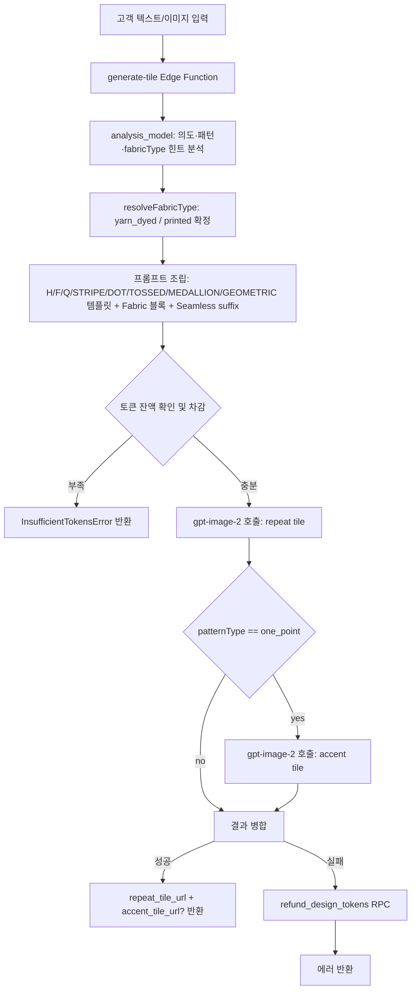

# Design (AI 디자인 생성)

고객이 텍스트 또는 이미지를 입력하면 단일 Edge Function `generate-tile`이 넥타이용 타일 이미지를 생성한다. 별도 상태 전이 없이 요청 -> 생성 -> 완료 또는 실패로 종료한다. 생성 비용은 요청 시 토큰으로 선차감되며, 이미지 생성 실패 시 차감된 토큰을 `refund_design_tokens` RPC로 복원한다.

## 경계

| 구분      | 내용                                                                                                                                                       |
| --------- | ---------------------------------------------------------------------------------------------------------------------------------------------------------- |
| Always do | 토큰 차감 전 잔액 확인. `token_refund`가 접수 상태인 동안 생성 요청 차단. paid 토큰 먼저 차감 후 bonus 차감. work_id 기반 멱등 처리로 중복 토큰 복원 방지. |
| Ask first | 토큰 비용 변경. bonus 토큰 환불 허용. Edge Function 추가 또는 폐기. 이미지 생성 모델 변경.                                                                 |
| Never do  | bonus 토큰 수동 환불 허용. 동일 주문 환불 중복 신청 허용. 프론트에서 토큰 잔액 계산.                                                                       |

## 상태 전이

없음. 단발성 프로세스로 상태 머신이 존재하지 않는다.

## 생성 프로세스 흐름



## 토큰 유형

| 유형  | 취득 방법                  | 환불 가능 여부             |
| ----- | -------------------------- | -------------------------- |
| paid  | 토큰 구매로 획득           | 가능 (고객 수동 환불 신청) |
| bonus | 신규 가입 지급 또는 이벤트 | 불가                       |

## AI 모델 및 Edge Function

| 구분            | Edge Function   | 역할             | 상태      | 비고                                                                     |
| --------------- | --------------- | ---------------- | --------- | ------------------------------------------------------------------------ |
| tile generation | `generate-tile` | 타일 생성 (통합) | 현행 운영 | `gpt-image-2`, `quality: "low"`, repeat tile 및 조건부 accent tile 생성. |

삭제된 레거시 경로:

- `generate-open-api`
- `prepare-pattern-composite`
- `prepare-pattern-source-openai`
- 프론트 provider chain
- 구조 제어, 인페인트, analysis-only, render-from-analysis 경로

## 비즈니스 규칙

- **BR-design-001**: 토큰 차감 순서 — paid 먼저 차감, 이후 bonus 차감.
- **BR-design-002**: `token_refund`가 접수 상태인 동안에는 토큰 사용 불가.
- **BR-design-003**: 모든 이미지 생성은 `gpt-image-2` + `quality: "low"` 단일 품질을 사용한다.
- **BR-design-004**: 이미지 생성 실패 시 선차감된 토큰을 `refund_design_tokens` RPC로 복원한다. `work_id` 기반 멱등 처리로 중복 복원 방지.
- **BR-design-005**: paid 토큰 미사용분은 전자거래 규정에 따라 고객이 수동 환불 신청 가능. bonus 불가.
- **BR-design-006**: 동일 주문에 `접수` 또는 `완료` 상태의 `token_refund`가 있으면 중복 신청 불가.
- **BR-design-007**: 신규 가입 시 bonus 토큰 30개 자동 지급.
- **BR-design-008**: 토큰 비용은 `admin_settings`에서 모델×요청 타입 조합으로 관리한다.
- **BR-design-009**: 멀티턴 대화 지원 — 프론트에서 conversation history를 유지해 `generate-tile`에 전달한다.
- **BR-design-010**: 원포인트(`patternType: "one_point"`) 요청은 repeat tile과 accent tile을 생성한다. 실패 시 각 호출 단위로 `work_id` 기반 멱등 복원한다.

## 화면 및 진입점

| 앱    | 경로                     | 설명        |
| ----- | ------------------------ | ----------- |
| store | `/design`                | 디자인 생성 |
| store | `/my-page/token-history` | 토큰 내역   |

## API 호출 흐름

```
프론트 → callTileGeneration()
  └─ source/reference 이미지는 Storage 업로드 후 signed URL로 전달
  └─ generate-tile 호출
       ├─ route: tile_generation 또는 tile_edit
       ├─ userMessage / designContext / conversationHistory 전달
       ├─ previous repeat/accent tile 메타데이터 전달
       └─ session message payload 전달
  └─ 응답 파싱
       ├─ repeatTile
       ├─ accentTile?
       ├─ patternType
       ├─ fabricType
       └─ accentLayout?
  └─ RPC: get_design_token_balance (업데이트된 잔액 조회)
```

## 관련 파일

| 파일                                                           | 설명                                 |
| -------------------------------------------------------------- | ------------------------------------ |
| `apps/store/src/entities/design/api/tile-generation-api.ts`    | 프론트 `generate-tile` 호출 레이어   |
| `apps/store/src/entities/design/api/tile-generation-mapper.ts` | `generate-tile` 요청/응답 매핑       |
| `apps/store/src/features/design/hooks/use-design-chat.ts`      | 디자인 채팅 생성 플로우              |
| `supabase/functions/generate-tile/index.ts`                    | 타일 기반 통합 Edge Function         |
| `supabase/functions/generate-tile/analysis.ts`                 | 의도·패턴·fabricType 분석            |
| `supabase/functions/generate-tile/prompt-builder.ts`           | repeat/accent tile 프롬프트 빌더     |
| `supabase/functions/generate-tile/image-generator.ts`          | `gpt-image-2` 이미지 생성 호출       |
| `supabase/schemas/86_design_tokens.sql`                        | 디자인 토큰 테이블 스키마            |
| `supabase/schemas/99_functions_design_tokens.sql`              | 토큰 RPC (use / refund / balance 등) |
| `docs/domains/tile_based_image_generation_design.md`           | 타일 기반 시스템 설계 문서           |

## 횡단 참조

- [[token]] — 토큰 구매, 유형별 정책 (paid 환불 / 이미지 생성 실패 시 복원)
- [[token-refund]] — 유상 토큰 환불 신청/승인 흐름
- [[tile_based_image_generation_design]] — 타일 기반 생성 시스템 설계

## 미결 사항

- 도메인 레벨 미결 사항: **없음**.
