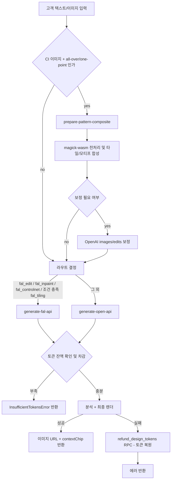
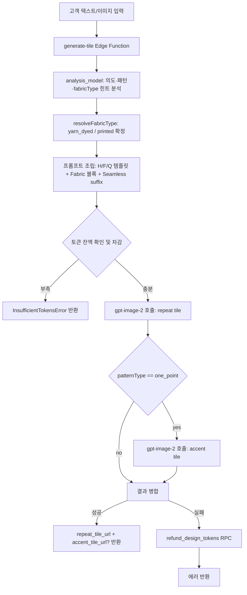

# Design (AI 디자인 생성)

고객이 텍스트 또는 이미지를 입력하면 AI 모델이 넥타이 디자인을 생성하는 단발성 프로세스. 별도 상태 전이 없이 요청→생성→완료(또는 실패)로 즉시 종료. 생성 비용은 요청 시 토큰으로 선차감되며, 이미지 미생성 시 차감된 토큰을 복원한다.

## 이행 중 (Migration in Progress)

본 도메인은 현재 `prepare-pattern-composite` + `generate-fal-api` + `generate-open-api` 3-Edge Function 구조로 운영 중이나, **타일 기반 이미지 생성 시스템(v1, 2026-04-24 승인)** 으로 전환 중이다. 전환 후에는 단일 Edge Function `generate-tile`로 통합되고, 이미지 모델은 `gpt-image-2` + `quality: "low"`로 단일화된다.

- 전환 설계 문서: [[tile_based_image_generation_design]] — 의사결정·재론 금지·v1/v2 스코프
- 구현 계약 문서: [[superpowers/specs/spec|타일 구현 계약]] — Edge Function 구현·프롬프트 템플릿·DB 스키마
- 본 문서는 **현행 구현(implemented) + 전환 계획**을 동시에 기술한다. 현행 경로는 그대로 유효하며, 전환 완료 시 본 문서의 `status`를 `implemented`로 되돌리고 현행 관련 설명을 제거한다.
- 토큰 정책(BR-design-001~007), 환불 흐름, 멀티턴 대화는 전환 후에도 **그대로 유지**된다. 전환의 영향 범위는 이미지 생성 파이프라인으로 한정된다.

## 경계

| 구분      | 내용                                                                                                                                                       |
| --------- | ---------------------------------------------------------------------------------------------------------------------------------------------------------- |
| Always do | 토큰 차감 전 잔액 확인. `token_refund`가 접수 상태인 동안 생성 요청 차단. paid 토큰 먼저 차감 후 bonus 차감. work_id 기반 멱등 처리로 중복 토큰 복원 방지. |
| Ask first | 토큰 비용 변경. bonus 토큰 환불 허용. 라우팅 체계 변경(Edge Function 추가·폐기 포함). 이미지 생성 모델 변경.                                               |
| Never do  | bonus 토큰 수동 환불 허용. 동일 주문 환불 중복 신청 허용. text_only에 high 품질 적용. 프론트에서 토큰 잔액 계산.                                           |

## 상태 전이

없음. 단발성 프로세스로 상태 머신이 존재하지 않는다.

### 생성 프로세스 흐름



### 이행 후 흐름 (타일 기반, 전환 완료 시 기본)

타일 기반 전환 완료 후 본 Mermaid는 아래로 교체된다. 전환 전까지는 참고용이며, 현행 흐름이 우선한다.



주요 변화:

- `prepare-pattern-composite` 삭제 (magick-wasm 기반 사전 합성 폐기)
- `generate-fal-api` · `generate-open-api` 삭제, 단일 `generate-tile`로 통합
- 프론트의 provider chain · `resolveGenerationRouteAsync` · `shouldUseFalPipeline` 삭제
- 이미지 생성은 `gpt-image-2` + `quality: "low"` + `webp`로 고정
- 합성은 프론트 캔버스에서만 수행, Edge Function은 타일만 반환

상세 설계와 재론 금지 항목은 [[tile_based_image_generation_design]], 구현 계약은 [[superpowers/specs/spec|타일 구현 계약]] 참조.

### 패턴 준비와 최종 렌더 분리

- `prepare-pattern-composite`는 반복 패턴의 최종 렌더러가 아니라 **사전 준비 단계**다.
- `all-over` 또는 `one-point`에서 CI 이미지가 있으면 먼저 이 Edge Function이 호출된다.
- 준비 단계에서는 `magick-wasm` 기반으로 소스 이미지를 잘라내고, 반복 타일(`composeAllOverTile`) 또는 원포인트 모티프(`composeOnePointMotif`)를 합성한다.
- 반복에 부적합한 소스만 OpenAI `images/edits`로 보정한다.
- 그 다음 최종 렌더를 `fal` 또는 `OpenAI` 중 하나로 보낸다.
- 따라서 `fal_tiling`은 “반복 패턴을 준비하는 단계”가 아니라 **준비된 반복 타일을 사용한 최종 렌더 라우트**를 뜻한다.
- `fal_tiling`으로 판정돼도 준비된 타일이 없으면 최종 호출은 `openai`로 폴백한다.

## 토큰 유형

| 유형  | 취득 방법                  | 환불 가능 여부             |
| ----- | -------------------------- | -------------------------- |
| paid  | 토큰 구매로 획득           | 가능 (고객 수동 환불 신청) |
| bonus | 신규 가입 지급 또는 이벤트 | 불가                       |

## AI 모델별 Edge Function

| 구분            | Edge Function               | 역할             | 상태                 | 비고                                                                                                                    |
| --------------- | --------------------------- | ---------------- | -------------------- | ----------------------------------------------------------------------------------------------------------------------- | ---------------- |
| preprocessing   | `prepare-pattern-composite` | 패턴 준비        | 현행 운영, 폐기 예정 | `magick-wasm` 기반 소스 정리, 반복 타일/모티프 합성, 필요 시 OpenAI 보정. 타일 전환 시 제거                             |
| openai render   | `generate-open-api`         | 최종 분석/생성   | 현행 운영, 폐기 예정 | 입력 이미지가 있으면 `images/edits`, 없으면 `images/generations` 사용. 타일 전환 시 제거                                |
| fal render      | `generate-fal-api`          | 최종 분석/생성   | 현행 운영, 폐기 예정 | `fal_edit`, `fal_inpaint`, `fal_controlnet`, 조건 충족 `fal_tiling` 담당. 타일 전환 시 제거                             |
| tile generation | `generate-tile`             | 타일 생성 (통합) | 승인, 구현 전        | `gpt-image-2` 단일 호출, `quality: "low"`, `tile_generation`·`tile_edit` route 통합 처리. 상세 [[superpowers/specs/spec | 타일 구현 계약]] |

## 비즈니스 규칙

- **BR-design-001**: 토큰 차감 순서 — paid 먼저 차감, 이후 bonus 차감.
- **BR-design-002**: `token_refund`가 접수 상태인 동안에는 토큰 사용 불가.
- **BR-design-003**: `text_only`는 high 품질 미지원. ※ 타일 전환 후에는 모든 생성이 `gpt-image-2` + `quality: "low"` 단일 품질로 수렴하므로 본 규칙은 폐기 예정. 상세 [[tile_based_image_generation_design]].
- **BR-design-004**: 이미지 미생성 시(데이터 부족 또는 텍스트 전용 응답) 선차감된 토큰을 `refund_design_tokens` RPC로 복원. `work_id` 기반 멱등 처리로 중복 복원 방지.
- **BR-design-005**: paid 토큰 미사용분은 전자거래 규정에 따라 고객이 수동 환불 신청 가능. bonus 불가.
- **BR-design-006**: 동일 주문에 `접수` 또는 `완료` 상태의 `token_refund`가 있으면 중복 신청 불가.
- **BR-design-007**: 신규 가입 시 bonus 토큰 30개 자동 지급.
- **BR-design-008**: 토큰 비용은 `admin_settings`에서 모델×요청 타입 조합으로 관리한다. 기본 요청 타입은 `analysis`, `prep`, `render_standard`, `render_high`이며, `prep`은 부적합 이미지의 OpenAI 패턴 보정이 실제 실행된 경우에만 별도 차감된다. ※ 타일 전환 후 요청 타입은 `analysis`(gpt-4 계열 분석) + `render`(gpt-image-2 low 생성) 2종으로 단순화 예정. `prep`·`render_high`는 폐기.
- **BR-design-009**: 멀티턴 대화 지원 — 프론트에서 `conversation_history` 유지해 Edge Function에 전달. ※ 타일 전환 후에도 유지.
- **BR-design-010**: `ciPlacement === "one-point"` 요청 시 첫 번째 색상으로 `solid` backgroundPattern을 자동 생성해 payload에 주입한다. 프롬프트에 배경 패턴 명세로 반영되어 AI가 다른 배경을 임의로 생성하지 않도록 제한한다. ※ 타일 전환 후에는 원포인트가 `repeat tile(배경) + accent tile(중앙 오브젝트)` 2개 타일 구조로 대체되므로 본 규칙은 폐기되고 `accentLayout`·`patternType: "one_point"` 로직으로 이관된다.
- **BR-design-011**: AI 응답의 `detectedDesign`에 `positionIntent`("move-left" | "move-right" | "move-up" | "move-down") 필드 포함. 모티프 위치 이동 요청을 감지해 후속 생성에 반영한다. ※ 타일 전환 후 폐기 — repeat tile은 H/F/Q 구조 템플릿으로 위치가 고정되며, accent tile 위치는 프론트엔드 캔버스 배치 규칙(대검 하단 20% 고정)으로 통제하므로 positionIntent 추론 자체가 불필요해진다.
- **BR-design-012** (신설, 타일 전환 시 적용): 원포인트(`patternType: "one_point"`) 요청은 `gpt-image-2` 호출이 2회(repeat + accent) 발생한다. 토큰 차감은 2회 독립 차감 방식을 기본으로 하며, 실패 시 각 호출 단위로 `work_id` 기반 멱등 복원한다. 세부 정책은 타일 전환 구현 시점에 [[tile_based_image_generation_design]] "미결 사항"에서 확정한다.

## 화면 및 진입점

| 앱    | 경로                     | 설명        |
| ----- | ------------------------ | ----------- |
| store | `/design`                | 디자인 생성 |
| store | `/my-page/token-history` | 토큰 내역   |

## API 호출 흐름

```
프론트 → ai-design-api.ts
  └─ source/ci/reference 이미지를 Base64로 변환
  └─ CI 이미지 + all-over/one-point면 prepare-pattern-composite 호출
       ├─ magick-wasm으로 source 정리
       ├─ all-over면 반복 타일 합성
       ├─ one-point면 모티프 합성
       └─ 필요 시 OpenAI images/edits로 보정
  └─ resolveGenerationRouteAsync로 최종 렌더 라우트 결정
  └─ shouldUseFalPipeline 판정
  └─ one-point CI 배치 시 solid backgroundPattern 자동 생성
  └─ provider chain 실행
       ├─ fal 조건 충족 → generate-fal-api
          fal_edit / fal_inpaint / fal_controlnet / 조건 충족 fal_tiling
       └─ 그 외 → generate-open-api
  └─ Edge Function 호출 (메시지 / 디자인 컨텍스트 / 대화 히스토리 / 첨부 파일 / backgroundPattern / prepared tile or motif)
  └─ 응답 파싱 (AI 메시지 / 이미지 URL / 태그 / contextChip / positionIntent)
  └─ RPC: get_design_token_balance (업데이트된 잔액 조회)
```

## 관련 파일

| 파일                                                             | 설명                                                                                                                                                                                                            |
| ---------------------------------------------------------------- | --------------------------------------------------------------------------------------------------------------------------------------------------------------------------------------------------------------- | ---------------- |
| `apps/store/src/entities/design/api/ai-design-api.ts`            | 프론트 AI 디자인 API 레이어 및 provider chain 진입점. 타일 전환 시 provider chain 제거, 단일 `generate-tile` 호출로 단순화                                                                                      |
| `apps/store/src/entities/design/api/ai-design-mapper.ts`         | Edge Function 호출 payload 빌더 (backgroundPattern 포함). 타일 전환 시 `tileLayout`·`accentLayout` 빌더로 교체                                                                                                  |
| `apps/store/src/entities/design/api/resolve-generation-route.ts` | 최종 렌더 라우트 판정. 타일 전환 시 **삭제**                                                                                                                                                                    |
| `apps/store/src/entities/design/api/should-use-fal-pipeline.ts`  | `fal_tiling` 사용 가능 여부 probe. 타일 전환 시 **삭제**                                                                                                                                                        |
| `supabase/functions/prepare-pattern-composite/index.ts`          | CI 패턴 준비 Edge Function. 타일 전환 시 **삭제**                                                                                                                                                               |
| `supabase/functions/_shared/pattern-composite.ts`                | `magick-wasm` 기반 source 정리 / 타일 / 모티프 합성. 타일 전환 시 **삭제**                                                                                                                                      |
| `supabase/functions/generate-fal-api/index.ts`                   | Fal 기반 최종 렌더 Edge Function. 타일 전환 시 **삭제**                                                                                                                                                         |
| `supabase/functions/generate-open-api/index.ts`                  | OpenAI 기반 최종 렌더 Edge Function. 타일 전환 시 **삭제**                                                                                                                                                      |
| `supabase/functions/generate-tile/index.ts`                      | 타일 기반 통합 Edge Function (**신규, 구현 예정**). 상세 [[superpowers/specs/spec                                                                                                                               | 타일 구현 계약]] |
| `supabase/functions/_shared/design-request.ts`                   | `BackgroundPattern` 타입 및 요청 스키마. 타일 전환 시 BackgroundPattern 폐기, tileLayout·accentLayout·fabricType 신규 스키마로 전면 교체                                                                        |
| `supabase/functions/_shared/prompt-builders.ts`                  | 이미지/텍스트 프롬프트 빌더 (positionIntent 포함). 타일 전환 시 전면 폐기 후 신규 작성 — H/F/Q 구조 템플릿 빌더 + Fabric 블록 빌더 + accent 빌더로 재구성. positionIntent 빌더는 BR-design-011 폐기와 함께 제거 |
| `supabase/functions/_shared/preprocessing/upscale.ts`            | 참조 이미지 업스케일 전처리 (512px 미만 자동 확대). 타일 전환 시 삭제 — gpt-image-2가 입력 이미지 크기 제약(총 픽셀 ≥655,360, 변 16배수)을 자체 처리하므로 사전 업스케일 불필요                                 |
| `supabase/schemas/86_design_tokens.sql`                          | 디자인 토큰 테이블 스키마. 타일 전환 영향 없음                                                                                                                                                                  |
| `supabase/schemas/99_functions_design_tokens.sql`                | 토큰 RPC (use / refund / balance 등). 타일 전환 영향 없음                                                                                                                                                       |
| `docs/domains/tile_based_image_generation_design.md`             | 타일 기반 시스템 설계 문서 (의사결정·재론 금지·v1/v2). [[tile_based_image_generation_design]]                                                                                                                   |
| `docs/superpowers/specs/spec.md`                                 | 타일 기반 시스템 구현 계약 (Edge Function·프롬프트 템플릿·DB 스키마). [[superpowers/specs/spec                                                                                                                  | 타일 구현 계약]] |

## 횡단 참조

- [[token]] — 토큰 구매, 유형별 정책 (paid 환불 / 이미지 미생성 시 복원)
- [[token-refund]] — 유상 토큰 환불 신청/승인 흐름
- [[tile_based_image_generation_design]] — 차기 타일 기반 생성 시스템 설계 (v1 승인, 구현 전). 의사결정·재론 금지·v1/v2 스코프
- [[superpowers/specs/spec|타일 구현 계약]] — 차기 타일 기반 생성 시스템 구현 계약. Edge Function·프롬프트 템플릿·DB 스키마

## 미결 사항

- 타일 기반 전환의 세부 미결 사항은 [[tile_based_image_generation_design]] "미결 사항" 섹션을 단일 출처로 참조한다.
- 도메인 레벨 미결 사항: **없음**. 전환 이후 타일 경로와 공존해야 하는 주변 시스템(토큰·환불·멀티턴 대화·positionIntent)의 구체 접점은 구현 시점에 [[tile_based_image_generation_design]]으로 편입한다.
