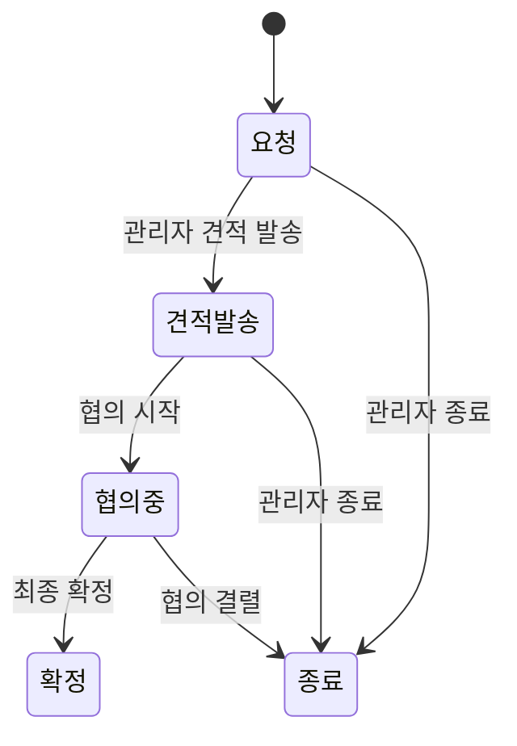

# Quote Request (견적 요청)

대량 주문 제작(최소 100개 이상)을 원하는 고객이 제작 조건을 제출하면 관리자가 견적을 발송하고 협의 후 확정하는 B2B 성격의 프로세스. 일반 주문과 독립적이며 결제는 별도 협의로 처리된다.

## 경계

| 구분      | 내용                                                                                                                                |
| --------- | ----------------------------------------------------------------------------------------------------------------------------------- |
| Always do | 견적 금액(`quoted_amount`)은 관리자 견적발송 시에만 입력. 고객 연락처(name/method/value) 모두 필수 검증. 최소 수량 100개 서버 검증. |
| Ask first | 최소 수량 기준 변경. 롤백 전이 추가.                                                                                                |
| Never do  | 롤백 전이 허용. 고객에게 견적 금액 사전 노출(견적발송 이전). 클레임 시스템 연결.                                                    |

## 상태 전이

### 상태값

| 상태     | 설명                             |
| -------- | -------------------------------- |
| 요청     | 고객이 견적 조건 제출 완료       |
| 견적발송 | 관리자가 견적 금액과 조건을 발송 |
| 협의중   | 고객과 관리자 간 협의 진행 중    |
| 확정     | 최종 견적 확정                   |
| 종료     | 협의 결렬 또는 관리자 종료 처리  |

### 상태 다이어그램

## 순방향 전이

| 현재 상태 | 다음 상태 | 조건                                 |
| --------- | --------- | ------------------------------------ |
| 요청      | 견적발송  | 관리자가 견적 금액/조건 입력 후 발송 |
| 요청      | 종료      | 관리자 종료 처리                     |
| 견적발송  | 협의중    | 협의 시작                            |
| 견적발송  | 종료      | 관리자 종료 처리                     |
| 협의중    | 확정      | 최종 견적 확정                       |
| 협의중    | 종료      | 협의 결렬 처리                       |
| 확정      | —         | 최종 상태                            |
| 종료      | —         | 최종 상태                            |

## 롤백 전이

없음. 모든 전이는 단방향이며 롤백을 허용하지 않는다.

## 전이 불가

| 상태 | 사유                                  |
| ---- | ------------------------------------- |
| 확정 | 최종 상태. 이후 전이 없음. 롤백 없음. |
| 종료 | 최종 상태. 이후 전이 없음. 롤백 없음. |

전체 상태 머신에서 롤백 전이 자체가 없다 (BR-quote-005).

## 비즈니스 규칙

- **BR-quote-001**: 최소 수량 100개 이상 필수. 서버에서 검증.
- **BR-quote-002**: 연락처 `name` / `method` / `value` 모두 필수. `method`는 `email` / `kakao` / `phone` 중 하나.
- **BR-quote-003**: 견적 금액(`quoted_amount`)은 견적발송 이후에만 고객에게 표시.
- **BR-quote-004**: 관리자 견적발송 시 `p_quoted_amount` / `p_quote_conditions` / `p_admin_memo` / `p_memo` 함께 저장 가능 (`admin_update_quote_request_status`).
- **BR-quote-005**: 롤백 전이 없음. 모든 전이 단방향.
- **BR-quote-006**: 종료 처리는 `admin_update_quote_request_status`로 직접 종료 상태 전환. 클레임 시스템 미사용.

## 화면 및 진입점

| 앱    | 경로                         | 설명                        |
| ----- | ---------------------------- | --------------------------- |
| store | `/my-page/quote-request`     | 견적 요청 목록              |
| store | `/my-page/quote-request/:id` | 견적 요청 상세              |
| admin | `/quote-requests`            | 견적 요청 목록              |
| admin | `/quote-requests/show/:id`   | 견적 요청 상세 및 상태 변경 |

## 관련 파일

| 파일                                                    | 설명               |
| ------------------------------------------------------- | ------------------ |
| `supabase/schemas/96_functions_quotes.sql`              | 견적 요청 RPC 전체 |
| `packages/shared/src/constants/quote-request-status.ts` | 상태 상수          |

## 횡단 참조

없음. 클레임 시스템 외부 도메인이며 일반 주문 흐름과 독립적으로 동작한다.

## 미결 사항

없음.
