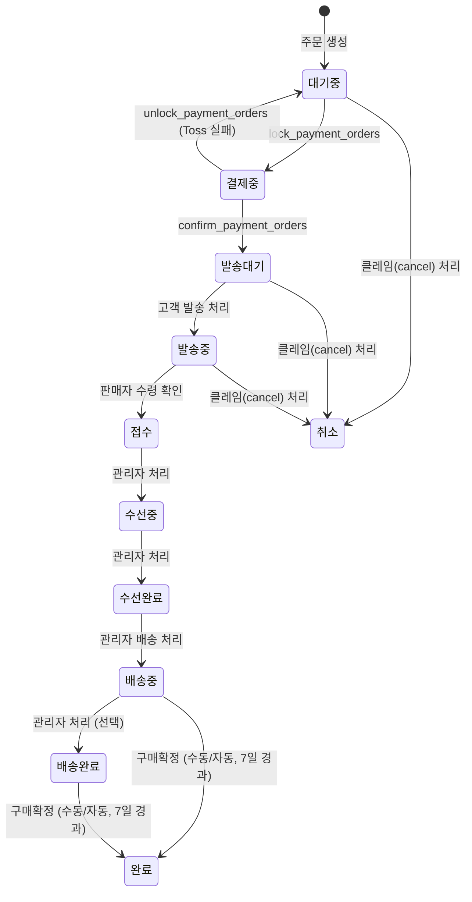

# Repair (수선 주문)

> 장바구니에서 수선 아이템(`item_type: reform`)을 추가하고 결제하면 자동으로 분리 생성되는 수선 주문 흐름. 결제 완료 후 판매자가 수선을 처리하고 배송하며, 구매확정으로 주문이 완료된다.

## 경계

| 구분      | 규칙                                                                                                                                      |
| --------- | ----------------------------------------------------------------------------------------------------------------------------------------- |
| Always do | 모든 상태 전이에 `auth.uid()` 소유권 검증 포함. 혼합 장바구니 시 reform 아이템은 별도 repair 주문으로 분리. `reform_data` 필드 필수 검증. |
| Ask first | 취소 환불 비율 조정.                                                                                                                      |
| Never do  | `접수` 이후 상태에서 취소. `배송중` 이후 상태에서 롤백. 프론트에서 수선 비용 계산.                                                        |

## 상태 전이



### 상태값

| 상태       | 설명                                      |
| ---------- | ----------------------------------------- |
| `대기중`   | 주문 생성 직후, 결제 대기                 |
| `결제중`   | Toss 결제 게이트웨이 호출 전 잠금 상태    |
| `발송대기` | 결제 완료 후, 고객이 수선물 발송 전 대기  |
| `발송중`   | 고객이 수선물을 판매자에게 배송 중        |
| `접수`     | 판매자가 수선물 수령 완료, 수선 시작 대기 |
| `수선중`   | 수선 작업 진행 중                         |
| `수선완료` | 수선 완료, 배송 준비                      |
| `배송중`   | 배송 시작 (판매자 → 고객)                 |
| `배송완료` | 배송 완료, 구매확정 대기                  |
| `완료`     | 구매확정 완료                             |
| `취소`     | 주문 취소                                 |

### 순방향

| 현재 상태  | 다음 상태  | 트리거                                                 |
| ---------- | ---------- | ------------------------------------------------------ |
| `대기중`   | `결제중`   | `lock_payment_orders`                                  |
| `결제중`   | `발송대기` | `confirm_payment_orders`                               |
| `결제중`   | `대기중`   | `unlock_payment_orders` (Toss 실패)                    |
| `발송대기` | `발송중`   | 고객 발송 처리                                         |
| `발송중`   | `접수`     | 관리자 수령 확인                                       |
| `접수`     | `수선중`   | 관리자 처리                                            |
| `수선중`   | `수선완료` | 관리자 처리                                            |
| `수선완료` | `배송중`   | 관리자 배송 처리                                       |
| `배송중`   | `배송완료` | 관리자 상태 변경 (선택적, 거의 사용 안 함)             |
| `배송중`   | `완료`     | 구매확정 (수동) 또는 shipped_at 기준 7일 경과 (자동)   |
| `배송완료` | `완료`     | 구매확정 (수동) 또는 delivered_at 기준 7일 경과 (자동) |

### 롤백

`is_rollback=true` + `memo`(사유) 필수. 오입력 정정 목적으로만 사용한다.

| 현재 상태  | 롤백 대상 | 조건                        |
| ---------- | --------- | --------------------------- |
| `접수`     | `발송중`  | is_rollback=true, memo 필수 |
| `수선중`   | `접수`    | is_rollback=true, memo 필수 |
| `수선완료` | `수선중`  | is_rollback=true, memo 필수 |

### 전이 불가

| 상태             | 불가 동작      | 이유                                                    |
| ---------------- | -------------- | ------------------------------------------------------- |
| `배송중`         | 이전 상태 복원 | 배송 시작 후 롤백 불가                                  |
| `배송완료`       | 이전 상태 복원 | 배송 완료 후 롤백 불가                                  |
| `완료`           | 이전 상태 복원 | 구매확정 후 롤백 불가                                   |
| `취소`           | 이전 상태 복원 | 취소 확정 후 롤백 불가                                  |
| `접수` 이후 전체 | 취소           | 수선물 수령 후 취소 불가 (반품/교환 클레임도 해당 없음) |

## 비즈니스 규칙

1. **BR-repair-001**: 결제 완료 시 repair 주문은 `결제중` → `발송대기`로 전이
2. **BR-repair-002**: Toss 결제 실패 시 `결제중` → `대기중` 자동 복구
3. **BR-repair-003**: 관리자 롤백 가능 상태: `접수` → `발송중`, `수선중` → `접수`, `수선완료` → `수선중`. `is_rollback=true`와 memo가 필수다
4. **BR-repair-004**: `배송중`/`배송완료`/`완료`/`취소`는 롤백 불가
5. **BR-repair-005**: 취소 불가 범위는 `접수` 이후(`접수`, `수선중`, `수선완료`, `배송중`, `배송완료`, `완료`). `발송대기`, `발송중`은 취소 가능
6. **BR-repair-006**: 취소 환불 규칙 — `대기중`/`발송대기`: 전액 환불. `발송중`: 반품 택배비(`REFORM_SHIPPING_COST`) 공제 후 환불
7. **BR-repair-007**: reform 아이템이 포함된 장바구니 결제 시 `create_order_txn`에서 자동으로 별도 repair 주문 생성. `payment_group_id`로 sale 주문과 묶임
8. **BR-repair-008**: 수선 비용(`REFORM_BASE_COST`, `REFORM_SHIPPING_COST`)은 `custom_order_pricing_constants` 테이블에서 관리. 서버 측 계산만 허용
9. **BR-repair-009**: 액션 주체를 구분한다. 결제 시스템은 `대기중` → `결제중` → `발송대기`, 고객은 `발송대기` → `발송중`, 관리자는 `발송중` 이후 상태만 직접 변경한다. `대기중`/`결제중`/`발송대기`에서는 관리자 확인과 취소만 가능하다

## 화면 및 진입점

| 앱    | 화면      | 경로                            | 관련 상태        |
| ----- | --------- | ------------------------------- | ---------------- |
| store | 수선 주문 | /reform                         | 대기중           |
| store | 주문서    | /order/order-form               | 대기중           |
| store | 주문 목록 | /order/order-list               | 전체 상태        |
| store | 주문 상세 | /order/:orderId                 | 전체 상태        |
| store | 발송 안내 | /order/repair-shipping/:orderId | 발송대기, 발송중 |
| admin | 주문 목록 | /orders?tab=repair              | 전체 상태        |
| admin | 주문 상세 | /orders/show/:orderId           | 전체 상태        |

**진입점**

- store `/reform` → 수선 아이템 추가 → 주문서(`/order/order-form`) → 결제 → 주문 상세

**혼합 장바구니 진입점**

- store `/cart`(reform 아이템 포함) → 주문하기 → 결제 → 주문 상세 (sale + repair 주문 동시 생성)

## API 호출 흐름

### 수선 주문 생성 (혼합 장바구니)

```text
프론트 → Edge Function: create-order
  └─ 아이템 배열에 reform 타입 포함
  └─ item_type=reform 이면 reform_data 필수
  └─ RPC: create_order_txn
       ├─ product 아이템 → orders(sale) 생성
       ├─ reform 아이템 → orders(repair) 생성
       └─ 동일 payment_group_id 부여
  └─ 반환: { payment_group_id, total_amount, orders: [{sale주문}, {repair주문}] }
```

### 결제

```text
프론트 → Edge Function: confirm-payment
  └─ payment_group_id로 모든 주문(sale + repair) 일괄 처리
  └─ repair 주문: 결제중 → 발송대기
  └─ sale 주문: 결제중 → 진행중
```

결제 정책 상세는 [[payment]] 참조.

## 수선 비용 구조

| 항목        | 상수명                 | 설명                                         |
| ----------- | ---------------------- | -------------------------------------------- |
| 기본 수선비 | `REFORM_BASE_COST`     | 수선 기본 비용                               |
| 수선 배송비 | `REFORM_SHIPPING_COST` | 수선 주문 전용 배송료 (일반 상품 주문은 0원) |

비용 값은 `public.custom_order_pricing_constants` 테이블에서 관리된다 (`REFORM_BASE_COST`, `REFORM_SHIPPING_COST` 키).

## 관련 파일

| 파일                                            | 역할                                         |
| ----------------------------------------------- | -------------------------------------------- |
| `supabase/schemas/93_functions_orders.sql`      | `create_order_txn` reform 분기 처리 포함     |
| `supabase/functions/create-order/index.ts`      | 주문 생성 Edge Function (reform 아이템 검증) |
| `supabase/functions/confirm-payment/index.ts`   | 결제 확정 Edge Function                      |
| `packages/shared/src/constants/order-status.ts` | 상태 상수 정의                               |

## 횡단 참조

- [[payment]] — 결제 흐름, Toss 연동, 환불 정책
- [[claim]] — 취소 클레임 처리
- [[sale]] — 혼합 장바구니 결제 시 함께 생성되는 일반 주문

## 미결 사항

<!-- QA 중 버그인지 기획 변경인지 애매한 항목을 여기에 기록 -->
<!-- 형식: - [ ] 항목 설명 (발견일, 관련 화면) -->
