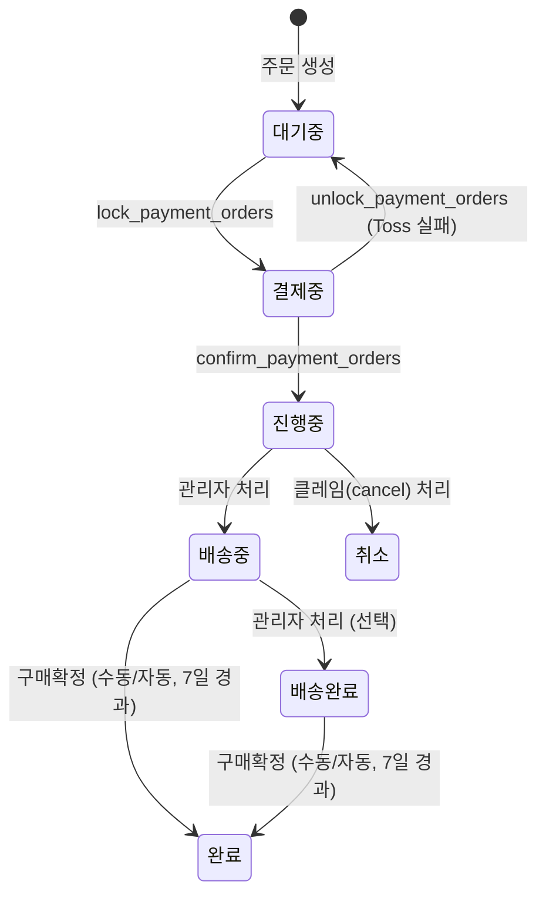

# Sale (일반 상품 주문)

> 장바구니 또는 상품 상세에서 바로 주문서로 진입해 결제하는 일반 주문 흐름. 결제 완료 후 판매자가 배송을 처리하고, 고객이 구매를 확정하면 주문이 완료된다.

## 경계

| 구분      | 규칙                                                                                                                                               |
| --------- | -------------------------------------------------------------------------------------------------------------------------------------------------- |
| Always do | 모든 상태 전이에 `auth.uid()` 소유권 검증을 포함한다. 결제 흐름은 Edge Function을 통해서만 처리한다. 구매확정 전 진행 중인 클레임 여부를 확인한다. |
| Ask first | `배송완료` → `완료` 자동 전이 타이밍 변경. 취소 허용 상태 범위 확대.                                                                               |
| Never do  | `배송중` 이후 상태에서 롤백. `배송중`·`배송완료`·`완료` 상태에서 취소. 프론트에서 금액 계산.                                                       |

## 상태 전이



주문 생성 단계에서 reform 아이템이 함께 들어오면 sale 주문과 repair 주문으로 분리 생성되며, 위 상태 전이는 sale 주문에만 적용된다. 분리된 repair 주문의 상태 전이는 [[repair]]를 따른다.

### 상태값

| 상태       | 설명                                          |
| ---------- | --------------------------------------------- |
| `대기중`   | 주문 생성 직후, 결제 대기 상태                |
| `결제중`   | Toss 결제 게이트웨이 호출 전 원자적 잠금 상태 |
| `진행중`   | 결제 확정 완료, 판매자 처리 대기              |
| `배송중`   | 판매자가 배송 시작                            |
| `배송완료` | 배송 완료, 구매확정 대기                      |
| `완료`     | 구매확정 완료                                 |
| `취소`     | 주문 취소 (클레임 처리)                       |

### 순방향

| 현재 상태  | 다음 상태  | 트리거                                                 |
| ---------- | ---------- | ------------------------------------------------------ |
| `대기중`   | `결제중`   | `lock_payment_orders` (service_role)                   |
| `결제중`   | `진행중`   | `confirm_payment_orders` (service_role)                |
| `결제중`   | `대기중`   | `unlock_payment_orders` (Toss 실패 복구)               |
| `진행중`   | `배송중`   | 관리자 상태 변경                                       |
| `배송중`   | `배송완료` | 관리자 상태 변경 (선택적, 거의 사용 안 함)             |
| `배송중`   | `완료`     | 구매확정 (수동) 또는 shipped_at 기준 7일 경과 (자동)   |
| `배송완료` | `완료`     | 구매확정 (수동) 또는 delivered_at 기준 7일 경과 (자동) |

### 롤백

`is_rollback=true` + `memo`(사유) 필수. 오입력 정정 목적으로만 사용한다.

| 현재 상태 | 롤백 대상 | 조건                        |
| --------- | --------- | --------------------------- |
| `진행중`  | `대기중`  | is_rollback=true, memo 필수 |

### 전이 불가

| 상태       | 불가 동작      | 이유                                            |
| ---------- | -------------- | ----------------------------------------------- |
| `배송중`   | 이전 상태 복원 | 배송 시작 후 롤백 불가                          |
| `배송완료` | 이전 상태 복원 | 배송 완료 후 롤백 불가                          |
| `완료`     | 이전 상태 복원 | 구매확정 후 롤백 불가                           |
| `취소`     | 이전 상태 복원 | 취소 확정 후 롤백 불가                          |
| `배송중`   | 취소           | 배송 시작 후 취소 불가, 반품/교환 클레임만 가능 |
| `배송완료` | 취소           | 배송 완료 후 취소 불가, 반품/교환 클레임만 가능 |
| `완료`     | 취소           | 구매확정 후 취소 불가                           |

## 비즈니스 규칙

1. **BR-sale-001**: 결제 완료 시 `결제중` → `진행중` 자동 전이 (Edge Function `confirm-payment`가 처리)
2. **BR-sale-002**: Toss 결제 실패 시 `결제중` → `대기중` 자동 복구, 쿠폰 예약 상태도 함께 복원
3. **BR-sale-003**: 롤백 시 memo(사유) 필수. `진행중` → `대기중` 롤백만 허용
4. **BR-sale-004**: `배송중`·`배송완료`·`완료`·`취소` 상태는 is_rollback 여부와 무관하게 이전 상태 복원 불가
5. **BR-sale-005**: `배송중` 이후(`배송중`·`배송완료`·`완료`)는 취소 불가. 반품(return) 또는 교환(exchange) 클레임만 가능
6. **BR-sale-006**: 구매확정(수동): 고객이 직접 `customer_confirm_purchase`를 호출한다. 허용 상태: `배송중`, `배송완료`. 진행 중인 클레임이 없어야 한다
7. **BR-sale-007**: 구매확정(자동): pg_cron 매일 03:00 KST (`auto_confirm_delivered_orders`). `배송완료`는 delivered_at 기준 7일, `배송중`은 shipped_at 기준 7일 경과 시 자동 완료. 진행 중인 클레임 없어야 함
8. **BR-sale-008**: 금액 계산(재고 차감, 쿠폰 적용, 최종 금액)은 RPC 서버 측(`create_order_txn`)에서만 수행
9. **BR-sale-009**: reform 아이템이 포함된 주문은 별도 주문으로 분리하여 생성
10. **BR-sale-010**: 장바구니 기반 주문은 결제 성공 후 해당 장바구니 아이템을 제거한다. 제거 실패가 주문 성공을 되돌리지는 않는다

## 화면 및 진입점

| 앱    | 화면      | 경로                  | 관련 상태 |
| ----- | --------- | --------------------- | --------- |
| store | 상품 상세 | /shop/:id             | -         |
| store | 장바구니  | /cart                 | -         |
| store | 주문서    | /order/order-form     | 대기중    |
| store | 결제 실패 | /order/payment/fail   | 결제 실패 |
| store | 주문 목록 | /order/order-list     | 전체 상태 |
| store | 주문 상세 | /order/:orderId       | 전체 상태 |
| admin | 주문 목록 | /orders?tab=sale      | 전체 상태 |
| admin | 주문 상세 | /orders/show/:orderId | 전체 상태 |

**진입점**

- A: 장바구니(`/cart`) → 주문서(`/order/order-form`) → 결제 → 주문 상세
- B: 상품 상세(`/shop/:id`) → 바로구매 → 주문서(`/order/order-form`) → 결제 → 주문 상세

참고: 수선 주문도 동일한 주문서 경로(`/order/order-form`)를 공유하지만, 주문 생성 후 상태 및 후속 화면은 [[repair]] 규칙을 따른다.

## API 호출 흐름

### 주문 생성

```text
프론트 → Edge Function: create-order
  └─ 입력 검증 (item_type별 필수 필드 확인)
  └─ 배송지 소유권 검증
  └─ RPC: create_order_txn
       ├─ 재고 차감
       ├─ 쿠폰 예약 (active → reserved)
       └─ 주문 생성
            ├─ 일반 상품 → sale 주문 생성
            └─ reform 아이템 포함 시 → repair 주문을 별도 생성
  └─ 반환: { payment_group_id, total_amount, orders[] }
```

### 결제

```text
프론트 → Toss SDK 결제 UI
프론트 → Edge Function: confirm-payment
  └─ RPC: lock_payment_orders (대기중 → 결제중)
  └─ Toss API: /v1/payments/confirm
  └─ 성공: RPC: confirm_payment_orders (결제중 → 진행중)
  └─ 실패: RPC: unlock_payment_orders (결제중 → 대기중, 쿠폰 복원)
```

결제 정책 상세는 [[payment]] 참조.

## 관련 파일

| 파일                                            | 역할                                                   |
| ----------------------------------------------- | ------------------------------------------------------ |
| `supabase/schemas/93_functions_orders.sql`      | 주문 RPC (create_order_txn, confirm_payment_orders 등) |
| `supabase/functions/create-order/index.ts`      | 주문 생성 Edge Function                                |
| `supabase/functions/confirm-payment/index.ts`   | 결제 확정 Edge Function                                |
| `packages/shared/src/constants/order-status.ts` | 상태 상수 정의                                         |

## 횡단 참조

- [[payment]] — 결제 흐름, Toss 연동, 환불 정책
- [[coupon]] — 쿠폰 예약/복원 규칙
- [[claim]] — 취소/반품/교환 클레임 처리

## 미결 사항

<!-- QA 중 버그인지 기획 변경인지 애매한 항목을 여기에 기록 -->
<!-- 형식: - [ ] 항목 설명 (발견일, 관련 화면) -->
