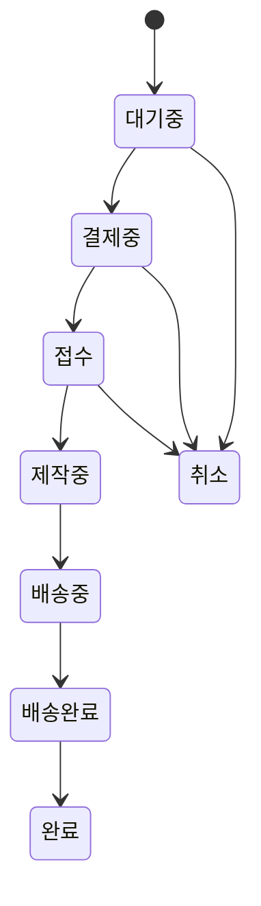

# Sample (샘플 제작)

> 샘플 제작은 `order_type='sample'` 전용 주문 도메인이다. 주문제작과 상태머신을 분리하고, 결제 확정 시 사용자당 타입별 1회 샘플 할인 쿠폰을 자동 지급한다.

## 경계

- 생성 경로: `create-sample-order` Edge Function -> `create_sample_order_txn`
- 타입별 가격: `pricing_constants`의 5개 키 (`SAMPLE_SEWING_COST`, `SAMPLE_FABRIC_PRINTING_COST`, `SAMPLE_FABRIC_YARN_DYED_COST`, `SAMPLE_FABRIC_AND_SEWING_PRINTING_COST`, `SAMPLE_FABRIC_AND_SEWING_YARN_DYED_COST`)
- 쿠폰: 타입별 5종 (`SAMPLE_DISCOUNT_SEWING`, `SAMPLE_DISCOUNT_FABRIC_PRINTING`, `SAMPLE_DISCOUNT_FABRIC_YARN_DYED`, `SAMPLE_DISCOUNT_FABRIC_AND_SEWING_PRINTING`, `SAMPLE_DISCOUNT_FABRIC_AND_SEWING_YARN_DYED`)
- 기존 `SAMPLE_DISCOUNT` 쿠폰은 `is_active = false`로 비활성화 (이미 발급된 user_coupons는 유지)
- custom 주문과 상태/환불/관리 UI를 공유하지 않는다

## 상태 전이

### 롤백

- `접수 -> 대기중`
- `제작중 -> 접수`
- 공통 조건: `is_rollback=true`, `memo` 필수

## 비즈니스 규칙

1. 샘플 타입은 `fabric`, `sewing`, `fabric_and_sewing`만 허용한다.
2. 가격은 sampleType + designType 조합으로 결정된다 (`pricing_constants` 5개 키 참조).
3. `fabric`, `fabric_and_sewing` 샘플은 `options.design_type`이 반드시 필요하다.
4. 결제 확정 시 주문 `item_data`의 `sample_type` / `options.design_type`을 읽어 해당 타입의 쿠폰을 자동 발급한다.
5. 쿠폰 매핑: `sewing` → `SAMPLE_DISCOUNT_SEWING`, `fabric+PRINTING` → `SAMPLE_DISCOUNT_FABRIC_PRINTING`, `fabric+YARN_DYED` → `SAMPLE_DISCOUNT_FABRIC_YARN_DYED`, `fabric_and_sewing+PRINTING` → `SAMPLE_DISCOUNT_FABRIC_AND_SEWING_PRINTING`, `fabric_and_sewing+YARN_DYED` → `SAMPLE_DISCOUNT_FABRIC_AND_SEWING_YARN_DYED`.
6. 쿠폰은 `user_coupons(user_id, coupon_id)` 유니크 제약으로 사용자당 타입별 1회만 지급한다.
7. 이미 발급되었거나 사용된 경우 `ON CONFLICT DO NOTHING`으로 조용히 무시한다.
8. 결제 응답의 `couponIssued`로 프론트에서 발급 여부를 분기 표시한다.
9. 환불은 `대기중/결제중/접수`에서만 전액 환불 가능하다.

## 관련 파일

- `supabase/migrations/20260319000000_sample_order_type.sql`
- `supabase/schemas/99_functions_sample.sql`
- `supabase/functions/create-sample-order/index.ts`
- `supabase/schemas/98_functions_payment.sql`
- `supabase/schemas/97_functions_admin.sql`
- `apps/store/src/features/sample-order/`

## QA 참조

- [[qa/sample]]
