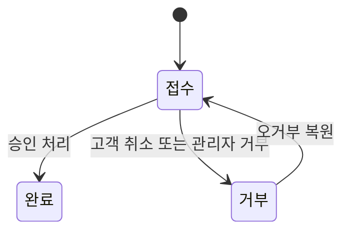

# Token Refund (유상 토큰 환불)

유상 토큰 구매 주문(`order_type='token'`)에 대해 고객이 환불을 신청하고, 서비스 경로가 최종 승인하는 도메인이다. 환불 요청 레코드는 `claims.type='token_refund'`로 관리한다.

## 경계

- 사용자 진입: 환불 가능 토큰 주문 목록에서 신청
- 고객 신청 RPC: `request_token_refund`
- 고객 취소 RPC: `cancel_token_refund`
- 최종 승인 RPC: `approve_token_refund` (`service_role` 전용)
- 표시 표면: store `/order/claim-list`에서 `token_refund` 타입으로 조회
- 토큰 구매 결제 자체는 [[payment]]와 [[token]] 정책을 따른다

## 상태 전이



### 롤백

- `거부 -> 접수`
- 조건: claim 공통 복원 규칙 적용

### 전이 불가

- `완료` 이후 재전이 불가
- `접수 -> 완료`는 `approve_token_refund` 경로에서만 가능
- 고객은 `접수` 상태에서만 직접 취소할 수 있다

## 비즈니스 규칙

1. 환불 신청은 본인 소유의 `token` 주문에 대해서만 가능하다.
2. 주문 상태가 `완료`여야만 환불 신청이 가능하다.
3. 환불 대상은 가장 최근 완료 토큰 주문 1건으로 제한한다.
4. 해당 주문으로 지급된 유상 토큰 이후 `design_tokens.type='use'` 이력이 있으면 환불 신청할 수 없다.
5. 같은 주문에 `token_refund`가 이미 `접수` 또는 `완료` 상태로 있으면 재신청할 수 없다.
6. 환불 금액은 토큰 주문의 `total_price` 전액이다.
7. 환불 요청의 지급 토큰 수량과 금액은 `claims.refund_data`에 기록한다.
8. 고객 취소는 `cancel_token_refund`로 처리하며, `접수 -> 거부`로 변경된다.
9. 최종 승인 시 `approve_token_refund`가 유상 토큰을 회수하고, 주문 상태를 `취소`로 바꾸고, 클레임 상태를 `완료`로 바꾼다.
10. `approve_token_refund`는 `service_role` 전용이며, 일반 admin RPC로는 완료 처리할 수 없다.

## API 호출 흐름

```text
프론트 (환불 가능 주문 조회)
  └─ get_refundable_token_orders RPC 호출
  └─ 결과: 주문별 환불 가능 여부, 불가 사유, 진행 중 요청 id 반환

프론트 (고객 환불 신청)
  └─ request_token_refund RPC 호출
  └─ RPC 내부: 주문 소유권 / 완료 상태 / 최신 주문 / 토큰 사용 여부 / 중복 요청 검증
  └─ 결과: claims(type='token_refund', status='접수') 생성

프론트 (고객 환불 취소)
  └─ cancel_token_refund RPC 호출
  └─ RPC 내부: 본인 요청 + 접수 상태 검증 후 status='거부'

서비스 경로 (최종 승인)
  └─ approve_token_refund RPC 호출
  └─ RPC 내부: 유상 토큰 회수 -> 주문 status='취소' -> claim status='완료'
```

## 관련 파일

- `supabase/schemas/99_functions_design_tokens.sql`
- `supabase/schemas/94_functions_claims.sql`
- `apps/store/src/entities/my-page/api/token-refund-api.ts`
- `apps/store/src/pages/claim/list.tsx`
- `docs/policies/token.md`

## 횡단 참조

- [[token]] — 토큰 잔액/원장 정책
- [[payment]] — 토큰 구매 결제 흐름
- [[claim]] — `token_refund` 클레임 상태 전이 공통 규칙
