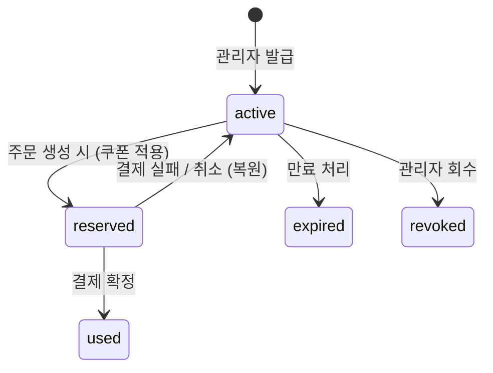

# 쿠폰 정책 (Coupon)

> sale / repair / custom-order / sample 주문에서 쿠폰을 적용한다. 일반 구매와 수선은 아이템 단위, 주문제작과 샘플은 주문 단위 할인으로 동작한다.

## 적용 표면

| 표면                                  | 대상            | 적용 단위   |
| ------------------------------------- | --------------- | ----------- |
| 장바구니 `/cart`                      | 일반 구매, 수선 | 아이템 단위 |
| 주문서 `/order/order-form`            | 일반 구매, 수선 | 아이템 단위 |
| 주문제작 결제 `/order/custom-payment` | custom-order    | 주문 단위   |
| 샘플 결제 `/order/sample-payment`     | sample          | 주문 단위   |

## 할인 타입

| 타입         | 설명                           |
| ------------ | ------------------------------ |
| `percentage` | 정률 할인 (단가 × 할인율 %)    |
| `fixed`      | 정액 할인 (아이템당 고정 금액) |

## 핵심 규칙

**PR-coupon-001**: 쿠폰 유효성 — 다음 4가지 조건 모두 충족 시만 사용 가능

- `user_coupons.status = 'active'`
- `coupons.is_active = true`
- `coupons.expiry_date >= current_date`
- `user_coupons.expires_at IS NULL OR > now()`

**PR-coupon-002**: 금액 계산은 라인(주문 아이템) 단위로 수행. 나머지(remainder)는 첫 번째 단위에 보존

**PR-coupon-003**: `max_discount_amount`가 설정된 경우 라인 전체 할인액의 상한으로 적용. `NULL`이면 상한 없음

**PR-coupon-004**: 동일 쿠폰 중복 사용 불가. 서로 다른 쿠폰은 라인 아이템별 각각 적용 가능

**PR-coupon-005**: 결제 실패 또는 취소 시 `reserved` → `active` 복원

**PR-coupon-006**: 샘플 주문 결제 성공 시 타입별 샘플 할인 쿠폰을 자동 발급할 수 있다. 이미 동일 쿠폰을 보유 중이면 중복 발급하지 않는다

## 할인 계산 공식

### percentage 쿠폰

```text
per_unit_discount = floor(unit_price × discount_value / 100)
capped_line_discount = least(per_unit_discount × qty, max_discount_amount)
final_unit_discount = floor(capped_line_discount / qty)
line_discount_remainder = capped_line_discount % qty
total_line_discount = (final_unit_discount × qty) + line_discount_remainder
```

### fixed 쿠폰

```text
capped_line_discount = least(discount_value × qty, max_discount_amount)
final_unit_discount = floor(capped_line_discount / qty)
line_discount_remainder = capped_line_discount % qty
total_line_discount = (final_unit_discount × qty) + line_discount_remainder
```

## 쿠폰 생명주기



| 상태       | 설명                                  |
| ---------- | ------------------------------------- |
| `active`   | 사용 가능                             |
| `reserved` | 주문 생성 후 결제 대기 중 (임시 예약) |
| `used`     | 결제 확정 완료, 사용됨                |
| `expired`  | 만료                                  |
| `revoked`  | 관리자 회수                           |

## 관리자 기능

| 기능          | 설명                                |
| ------------- | ----------------------------------- |
| 쿠폰 발급     | 특정 사용자에게 쿠폰 부여           |
| 쿠폰 회수     | `status = 'revoked'`로 변경         |
| 프리셋 타겟팅 | 조건에 맞는 사용자 그룹에 일괄 발급 |

## 관련 파일

| 파일                                              | 역할                                                                       |
| ------------------------------------------------- | -------------------------------------------------------------------------- |
| `supabase/schemas/30_coupons.sql`                 | 쿠폰 테이블 스키마                                                         |
| `supabase/schemas/31_user_coupons.sql`            | 사용자 쿠폰 테이블 스키마                                                  |
| `packages/shared/src/utils/calculate-discount.ts` | 프론트 할인 계산 유틸 (UI 미리보기 전용, 실제 금액 계산의 기준은 RPC 서버) |

## 횡단 참조

- [[sale]] — 주문 생성 시 쿠폰 예약
- [[repair]] — 수선 주문의 아이템 단위 쿠폰 적용
- [[payment]] — 결제 확정/실패 시 쿠폰 상태 전환
- [[sample]] — 샘플 주문 결제 후 쿠폰 자동 발급
