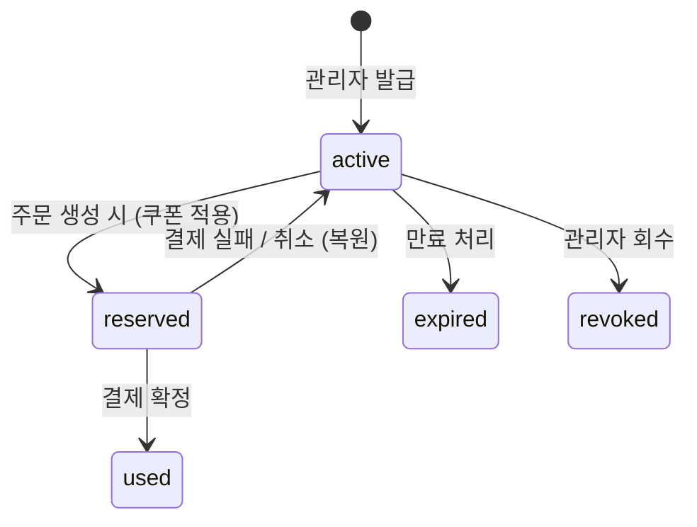

# 쿠폰 정책 (Coupon Policy)

## 1. 개요

- **구현 상태**: 구현됨
- **적용 범위**: sale / repair / custom 주문 생성 시 라인 단위 할인 적용

---

## 2. 할인 타입

| 타입 | 설명 |
|------|------|
| `percentage` | 정률 할인 (단가 × 할인율 %) |
| `fixed` | 정액 할인 (아이템당 고정 금액) |

---

## 3. 쿠폰 유효성 조건

쿠폰이 사용 가능하려면 다음 조건을 모두 충족해야 한다:

| 조건 | 설명 |
|------|------|
| `user_coupons.status = 'active'` | 사용 가능 상태 |
| `coupons.is_active = true` | 쿠폰 활성화됨 |
| `coupons.expiry_date >= current_date` | 쿠폰 자체 만료일 미경과 |
| `user_coupons.expires_at IS NULL OR > now()` | 개인 만료일 미경과 |

---

## 4. 할인 계산 규칙 (라인 단위)

금액 계산은 라인(주문 아이템) 단위로 수행한다.
나머지(remainder)는 첫 번째 단위에 보존한다.

### percentage 쿠폰

```text
per_unit_discount = floor(unit_price × discount_value / 100)
capped_line_discount = least(per_unit_discount × qty, max_discount_amount)
final_unit_discount = floor(capped_line_discount / qty)
line_discount_remainder = capped_line_discount % qty
total_line_discount = (final_unit_discount × qty) + line_discount_remainder
```

### fixed 쿠폰

```text
capped_line_discount = least(discount_value × qty, max_discount_amount)
final_unit_discount = floor(capped_line_discount / qty)
line_discount_remainder = capped_line_discount % qty
total_line_discount = (final_unit_discount × qty) + line_discount_remainder
```

### max_discount_amount

- `max_discount_amount`가 설정된 경우 라인 전체 할인액의 상한으로 적용된다.
- `NULL`이면 상한 없음.

---

## 5. 쿠폰 생명주기



| 상태 | 설명 |
|------|------|
| `active` | 사용 가능 |
| `reserved` | 주문 생성 후 결제 대기 중 (임시 예약) |
| `used` | 결제 확정 완료, 사용됨 |
| `expired` | 만료 |
| `revoked` | 관리자 회수 |

---

## 6. 중복 사용 방지

| 규칙 | 설명 |
|------|------|
| 동일 쿠폰 중복 사용 불가 | 한 주문에 같은 쿠폰 ID를 두 번 사용할 수 없음 |
| 서로 다른 쿠폰 | 라인 아이템별로 각각 적용 가능 |

---

## 7. 관리자 기능

| 기능 | 설명 |
|------|------|
| 쿠폰 발급 | 특정 사용자에게 쿠폰 부여 |
| 쿠폰 회수 | `status = 'revoked'`로 변경 |
| 프리셋 타겟팅 | 조건에 맞는 사용자 그룹에 일괄 발급 |

---

## 8. 관련 프로세스

- [sale-process.md](../processes/sale-process.md) — 주문 생성 시 쿠폰 예약
- [payment-policy.md](./payment-policy.md) — 결제 확정/실패 시 쿠폰 상태 전환

---

## 9. 관련 파일

| 파일 | 역할 |
|------|------|
| `supabase/schemas/30_coupons.sql` | 쿠폰 테이블 스키마 |
| `supabase/schemas/31_user_coupons.sql` | 사용자 쿠폰 테이블 스키마 |
| `packages/shared/src/utils/calculate-discount.ts` | 프론트 할인 계산 유틸 (UI 미리보기 전용, 실제 금액 계산의 기준은 RPC 서버) |
