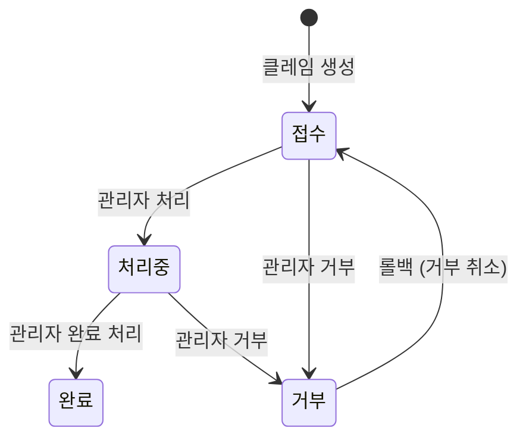
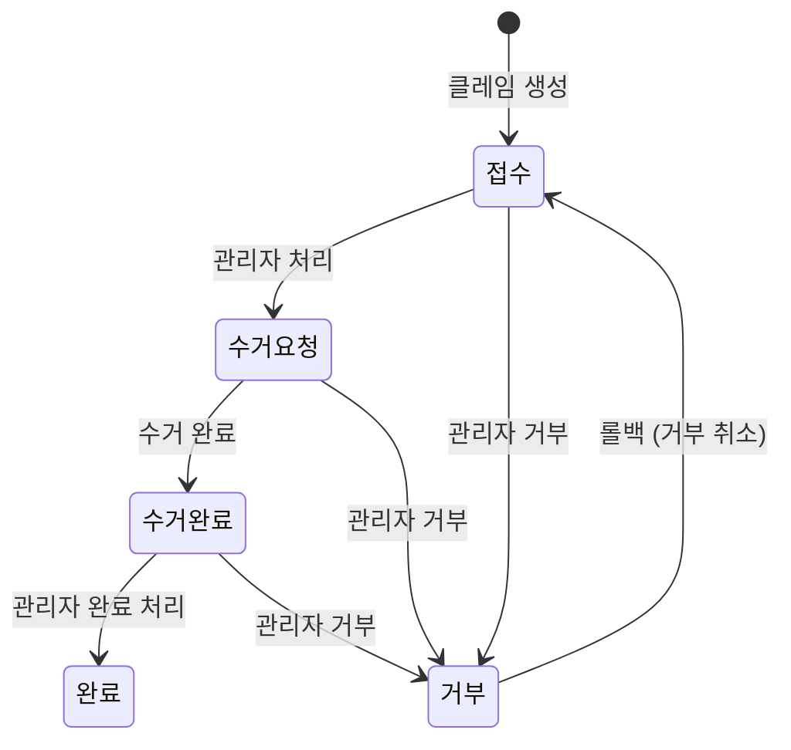
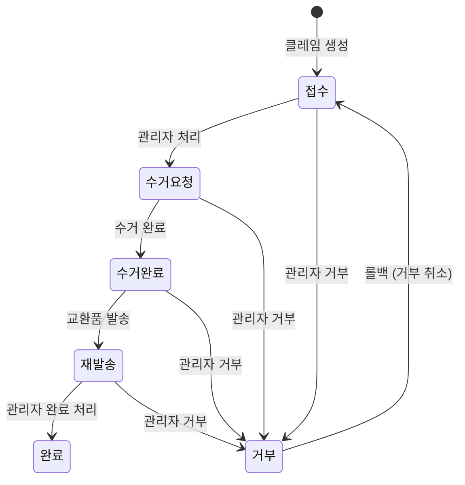

---
tags:
  - process
  - claim
---

# 클레임 프로세스 (Claim)

## 1. 개요

클레임은 주문 후 고객이 취소·반품·교환을 요청하는 프로세스다.
3가지 타입으로 구분되며, 주문 상태에 따라 생성 가능한 클레임 타입이 다르다.

클레임은 `orders` 테이블에 연결된 주문에 대해서만 생성 가능하다.
**quote-request(견적 요청)** 와 **design-token(토큰 구매)** 는 클레임 시스템 밖이며, 각자의 종료/환불 메커니즘을 사용한다.

---

## 2. 주문 타입별 클레임 가능 조건

> **구현 위치**: 상태 제한은 프론트엔드 `CLAIM_ACTIONS_BY_STATUS`에서만 처리한다.
> `create_claim` RPC는 주문 상태를 검증하지 않으므로, 프론트의 `getClaimActions(status)` 결과를 기반으로 UI에서 제어한다.

### sale 주문

| 주문 상태        | 가능한 클레임    |
| ---------------- | ---------------- |
| `대기중`         | cancel           |
| `진행중`         | cancel           |
| `배송중`         | return, exchange |
| `배송완료`       | return, exchange |
| `완료`           | 없음             |
| `결제중`, `취소` | 없음             |

### repair 주문

| 주문 상태        | 가능한 클레임    | 비고                                      |
| ---------------- | ---------------- | ----------------------------------------- |
| `대기중`         | cancel           |                                           |
| `발송대기`       | cancel           | 미구현 (`CLAIM_ACTIONS_BY_STATUS` 미매핑) |
| `발송중`         | cancel           | 미구현 (`CLAIM_ACTIONS_BY_STATUS` 미매핑) |
| `접수`           | 없음             |                                           |
| `수선중`         | 없음             |                                           |
| `수선완료`       | 없음             |                                           |
| `배송중`         | return, exchange |                                           |
| `배송완료`       | return, exchange |                                           |
| `완료`           | 없음             |                                           |
| `결제중`, `취소` | 없음             |                                           |

### custom 주문

| 주문 상태                   | 가능한 클레임    | 비고                                      |
| --------------------------- | ---------------- | ----------------------------------------- |
| `대기중`                    | cancel           |                                           |
| `접수`                      | cancel           | 미구현 (`CLAIM_ACTIONS_BY_STATUS` 미매핑) |
| `제작중`                    | cancel           | 미구현 (`CLAIM_ACTIONS_BY_STATUS` 미매핑) |
| `샘플원단제작중`~`샘플승인` | cancel           | 미구현 (`CLAIM_ACTIONS_BY_STATUS` 미매핑) |
| `제작완료`                  | 없음             |                                           |
| `배송중`                    | return, exchange |                                           |
| `배송완료`                  | return, exchange |                                           |
| `완료`                      | 없음             |                                           |
| `결제중`, `취소`            | 없음             |                                           |

### quote-request (클레임 시스템 외부)

클레임 생성 불가. 관리자가 `admin_update_quote_request_status`로 직접 `종료` 상태로 전환한다.

### design-token 구매 (클레임 시스템 외부)

클레임 생성 불가. 두 가지 환불 경로가 별도로 존재한다:

| 상황                | 환불 방법                                                 |
| ------------------- | --------------------------------------------------------- |
| Toss 결제 실패      | `unlock_token_payment` RPC (결제중 → 대기중, 토큰 미지급) |
| AI 이미지 생성 실패 | `refund_design_tokens` RPC (work_id 기반 멱등 환불)       |

---

## 3. 클레임 상태값

### cancel 전용 상태

| 상태     | 설명              |
| -------- | ----------------- |
| `접수`   | 클레임 생성 직후  |
| `처리중` | 취소 처리 진행 중 |
| `완료`   | 취소 완료         |
| `거부`   | 클레임 거부       |

### return / exchange 공통 상태

| 상태       | 설명                |
| ---------- | ------------------- |
| `접수`     | 클레임 생성 직후    |
| `수거요청` | 배송사에 수거 요청  |
| `수거완료` | 반품 물품 수거 완료 |
| `완료`     | (return) 반품 완료  |
| `거부`     | 클레임 거부         |

### exchange 전용 추가 상태

| 상태     | 설명                |
| -------- | ------------------- |
| `재발송` | 교환 상품 재발송 중 |

---

## 4. 순방향 상태 전이

### cancel

| 현재 상태 | 다음 상태        |
| --------- | ---------------- |
| `접수`    | `처리중`, `거부` |
| `처리중`  | `완료`, `거부`   |

### return

| 현재 상태  | 다음 상태          |
| ---------- | ------------------ |
| `접수`     | `수거요청`, `거부` |
| `수거요청` | `수거완료`, `거부` |
| `수거완료` | `완료`, `거부`     |

### exchange

| 현재 상태  | 다음 상태          |
| ---------- | ------------------ |
| `접수`     | `수거요청`, `거부` |
| `수거요청` | `수거완료`, `거부` |
| `수거완료` | `재발송`, `거부`   |
| `재발송`   | `완료`, `거부`     |

---

## 5. 롤백 전이

`is_rollback=true` + `memo`(사유) 필수.

| 클레임 타입 | 현재 상태  | 롤백 대상 |
| ----------- | ---------- | --------- |
| cancel      | `처리중`   | `접수`    |
| return      | `수거요청` | `접수`    |
| exchange    | `수거요청` | `접수`    |
| 모든 타입   | `거부`     | `접수`    |

> **불가 상태**: `수거완료`, `재발송`, `완료`는 is_rollback 여부와 무관하게 이전 상태 복원 불가.

---

## 6. 클레임 이유

| 코드             | 설명          |
| ---------------- | ------------- |
| `change_mind`    | 단순 변심     |
| `defect`         | 불량 / 파손   |
| `delay`          | 배송 지연     |
| `wrong_item`     | 오배송        |
| `size_mismatch`  | 사이즈 불일치 |
| `color_mismatch` | 색상 불일치   |
| `other`          | 기타          |

---

## 7. 관련 파일

| 파일                                             | 역할             |
| ------------------------------------------------ | ---------------- |
| `supabase/schemas/94_functions_claims.sql`       | 클레임 RPC 전체  |
| `packages/shared/src/constants/claim-status.ts`  | 클레임 상태 상수 |
| `packages/shared/src/constants/claim-actions.ts` | 클레임 액션 상수 |
