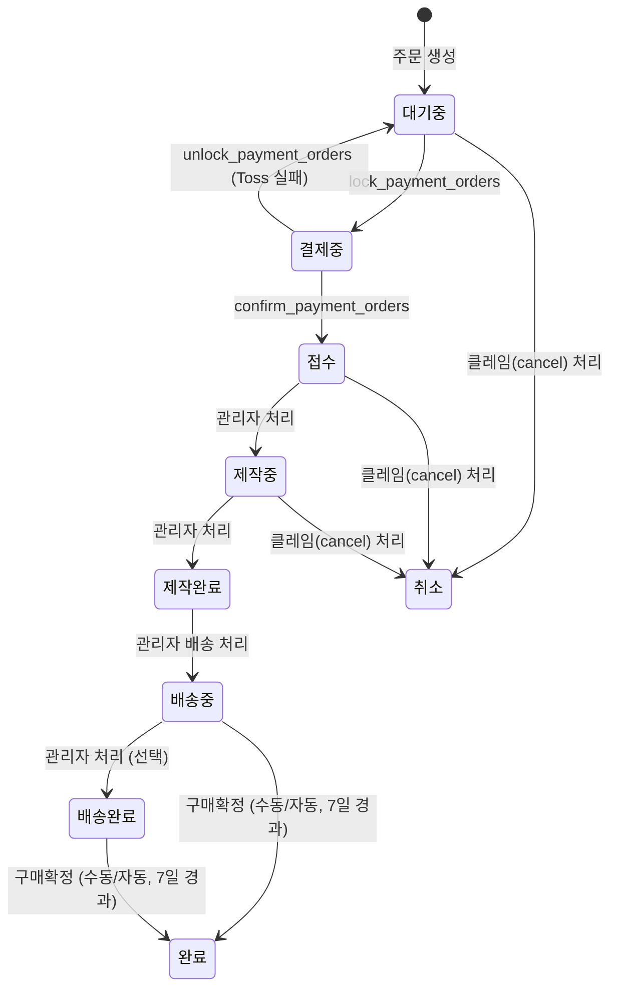

# 주문 제작 프로세스 (Custom Order)

## 1. 개요

`custom` 타입 주문은 고객이 넥타이 옵션(원단, 봉제 옵션 등)을 직접 선택해 맞춤 제작을 의뢰하는 주문 흐름이다.
가격은 서버 측 RPC(`calculate_custom_order_amounts`)에서 옵션별로 계산된다.
별도의 Edge Function(`create-custom-order`)을 통해 생성되며, 일반 상품 주문과 장바구니를 공유하지 않는다.

---

## 2. 상태값

| 상태 | 설명 |
|------|------|
| `대기중` | 주문 생성 직후, 결제 대기 |
| `결제중` | Toss 결제 게이트웨이 호출 전 잠금 상태 |
| `접수` | 결제 확정 완료, 제작 시작 대기 |
| `제작중` | 제작 작업 진행 중 |
| `제작완료` | 제작 완료, 배송 준비 |
| `배송중` | 배송 시작 |
| `배송완료` | 배송 완료, 구매확정 대기 |
| `완료` | 구매확정 완료 |
| `취소` | 주문 취소 |

---

## 3. 순방향 상태 전이

| 현재 상태 | 다음 상태 | 트리거 |
|---------|---------|-------|
| `대기중` | `결제중` | `lock_payment_orders` |
| `결제중` | `접수` | `confirm_payment_orders` |
| `결제중` | `대기중` | `unlock_payment_orders` (Toss 실패) |
| `접수` | `제작중` | 관리자 처리 |
| `제작중` | `제작완료` | 관리자 처리 |
| `제작완료` | `배송중` | 관리자 배송 처리 |
| `배송중` | `배송완료` | 관리자 상태 변경 (선택적, 거의 사용 안 함) |
| `배송중` | `완료` | 구매확정 (수동) 또는 shipped_at 기준 7일 경과 (자동) |
| `배송완료` | `완료` | 구매확정 (수동) 또는 delivered_at 기준 7일 경과 (자동) |

---

## 4. 롤백 전이

`is_rollback=true` + `memo`(사유) 필수. 오입력 정정 목적으로만 사용한다.

| 현재 상태 | 롤백 대상 | 조건 |
|---------|---------|------|
| `접수` | `대기중` | is_rollback=true, memo 필수 |
| `제작중` | `접수` | is_rollback=true, memo 필수 |
| `제작완료` | `제작중` | is_rollback=true, memo 필수 |

> **불가 상태**: `배송중`, `배송완료`, `완료`, `취소`는 이전 상태 복원 불가.

---

## 5. 가격 계산 규칙

모든 금액 계산은 서버 RPC `calculate_custom_order_amounts`에서만 수행한다.

### 봉제비 (Sewing Cost)

| 옵션 | 상수명 | 설명 |
|------|--------|------|
| 기본 제작비 | `START_COST` | 건당 고정 기본비 |
| 기본 봉제비 | `SEWING_PER_COST` | 수량 단위 봉제비 |
| 자동 넥타이 | `AUTO_TIE_COST` | 추가 비용 |
| 삼각 스티치 | `TRIANGLE_STITCH` | 옵션 추가비 |
| 사이드 스티치 | `SIDE_STITCH` | 옵션 추가비 |
| 바택 | `BAR_TACK` | 옵션 추가비 |
| 딤플 | `DIMPLE` | 옵션 추가비 |
| 스포데라토 | `SPODERATO` | 옵션 추가비 |
| 폴드7 | `FOLD7` | 옵션 추가비 |
| 울 심지 | `WOOL_INTERLINING` | 옵션 추가비 |
| 브랜드 라벨 | `BRAND_LABEL` | 옵션 추가비 |
| 케어 라벨 | `CARE_LABEL` | 옵션 추가비 |

**상호배타적 옵션**: `dimple`, `spoderato`, `fold7` 중 최대 1개만 선택 가능.

### 원단비 (Fabric Cost)

| 조건 | 비용 |
|------|------|
| 고객 제공 원단 | 0원 |
| 매장 원단 선택 | `design_type + fabric_type` 조합으로 단가 조회 |
| YARN_DYED 디자인 | 추가 비용 발생 |

비용 단가는 `admin_settings` 테이블에서 관리된다.

---

## 6. 취소 규칙

| 취소 가능 주문 상태 | 비고 |
|----------------|------|
| `대기중` | 결제 전이므로 즉시 취소 가능 |
| `접수` | 클레임(cancel) 생성 후 관리자 처리 |
| `제작중` | 클레임(cancel) 생성 후 관리자 처리 |

`제작완료` 이후 상태에서는 취소 불가.

자세한 내용은 [claim-process.md](./claim-process.md) 참조.

---

## 7. 관련 파일

| 파일 | 역할 |
|------|------|
| `supabase/schemas/95_functions_custom_orders.sql` | `create_custom_order_txn`, `calculate_custom_order_amounts` |
| `supabase/functions/create-custom-order/index.ts` | 주문 제작 생성 Edge Function |
| `supabase/functions/confirm-payment/index.ts` | 결제 확정 Edge Function |
| `packages/shared/src/constants/order-status.ts` | 상태 상수 정의 |
