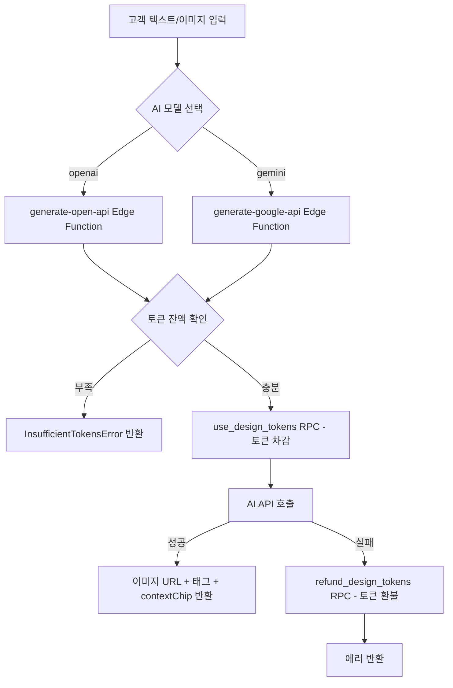

---
tags:
  - process
  - design
---

# AI 디자인 생성 프로세스 (Design)

## 1. 개요

AI 디자인 생성은 고객이 텍스트 또는 이미지를 입력하면 AI 모델이 넥타이 디자인을 생성하는 단발성 프로세스다.
별도의 상태 전이 없이 요청 → 생성 → 완료(또는 실패)로 즉시 종료된다.
생성 비용은 디자인 토큰으로 차감되며, 실패 시 자동 환불된다.

---

## 2. 프로세스 흐름



---

## 3. AI 모델별 Edge Function

| 모델     | Edge Function         | 요청 타입       |
| -------- | --------------------- | --------------- |
| `openai` | `generate-open-api`   | 텍스트 / 이미지 |
| `gemini` | `generate-google-api` | 텍스트 / 이미지 |

---

## 4. 토큰 소비 규칙

토큰 비용은 `admin_settings`에서 모델 × 요청 타입 × 품질 조합으로 관리된다.

| 설정 키                               | 설명                                  |
| ------------------------------------- | ------------------------------------- |
| `design_token_cost_openai_text`       | OpenAI 텍스트 전용                    |
| `design_token_cost_openai_image`      | OpenAI 텍스트 + 이미지 (standard)     |
| `design_token_cost_openai_image_high` | OpenAI 텍스트 + 이미지 (high quality) |
| `design_token_cost_gemini_text`       | Gemini 텍스트 전용                    |
| `design_token_cost_gemini_image`      | Gemini 텍스트 + 이미지 (standard)     |
| `design_token_cost_gemini_image_high` | Gemini 텍스트 + 이미지 (high quality) |

`use_design_tokens` 파라미터:

- `p_ai_model`: `'openai'` | `'gemini'`
- `p_request_type`: `'text_only'` | `'text_and_image'`
- `p_quality`: `'standard'` | `'high'`

---

## 5. 토큰 환불

### 자동 환불 (이미지 미생성)

AI가 이미지를 생성하지 않은 경우(데이터 부족 또는 텍스트 전용 응답으로 이미지 생성이 불필요한 케이스) `refund_design_tokens`를 호출해 차감된 토큰을 자동 환불한다.

| 항목      | 규칙                                              |
| --------- | ------------------------------------------------- |
| 멱등성    | `work_id` 기반으로 중복 환불 방지                 |
| 호출 권한 | service_role 전용 (Edge Function 내부에서만 호출) |

### 수동 환불 신청 (고객 요청)

전자거래 규정에 따라 고객이 구매한 `paid` 토큰의 미사용분에 대해 환불을 신청할 수 있다.

| 항목      | 규칙                                      |
| --------- | ----------------------------------------- |
| 대상 토큰 | `paid` 토큰만 환불 가능 (`bonus` 불가)    |
| 중복 신청 | 동일 주문에 `pending` 환불 요청 중복 불가 |
| 처리      | 관리자 승인 후 환불 처리                  |

---

## 6. 멀티턴 대화 지원

디자인 생성은 단발성이지만, 프론트에서 대화 히스토리(`conversation_history`)를 유지해
이전 대화 맥락을 Edge Function에 전달할 수 있다.

---

## 7. API 호출 흐름

```
프론트 → ai-design-api.ts
  └─ 참조 이미지를 Base64로 변환
  └─ AI 모델에 따라 Edge Function 선택
  └─ Edge Function 호출
       ├─ 메시지 (텍스트)
       ├─ 디자인 컨텍스트
       ├─ 대화 히스토리 (멀티턴)
       └─ 첨부 파일 (선택)
  └─ 응답 파싱
       ├─ AI 메시지 텍스트
       ├─ 이미지 URL (생성된 경우)
       ├─ 태그 (설명 태그)
       └─ contextChip (색상, 패턴 등 메타데이터)
  └─ RPC: get_design_token_balance (업데이트된 잔액 조회)
```

### 토큰 잔액 부족 시

```
Edge Function → use_design_tokens 실패
  └─ insufficient_tokens 에러 코드 반환
프론트 → InsufficientTokensError throw
  └─ 토큰 충전 안내 UI 표시
```

---

## 8. 관련 파일

| 파일                                                  | 역할                               |
| ----------------------------------------------------- | ---------------------------------- |
| `apps/store/src/features/design/api/ai-design-api.ts` | 프론트 AI 디자인 API 레이어        |
| `supabase/schemas/86_design_tokens.sql`               | 디자인 토큰 테이블 스키마          |
| `supabase/schemas/99_functions_design_tokens.sql`     | 토큰 RPC (use, refund, balance 등) |

토큰 정책 상세는 [[token-policy]] 참조.
