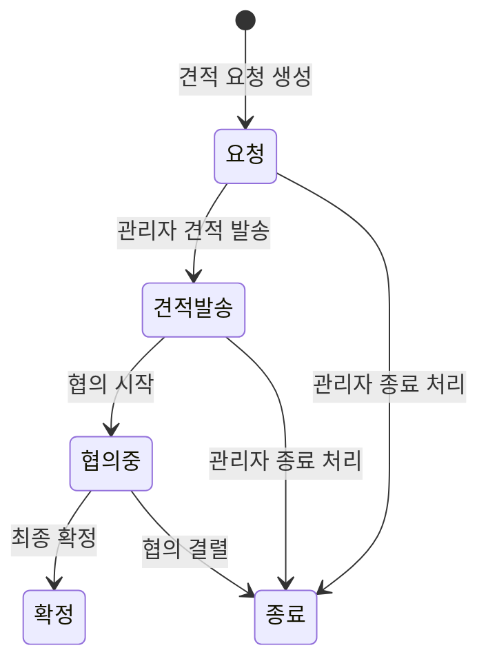

# 견적 요청 프로세스 (Quote Request)

## 1. 개요

견적 요청은 대량 주문 제작(최소 100개 이상)을 원하는 고객이 제작 조건을 제출하면,
관리자가 견적을 발송하고 협의 후 확정하는 B2B 성격의 프로세스다.

일반 주문(`create-order`, `confirm-payment`)과는 독립적인 별도 흐름이며,
결제는 별도 협의를 통해 처리된다.

---

## 2. 상태값

| 상태       | 설명                                 |
| ---------- | ------------------------------------ |
| `요청`     | 고객이 견적 요청 제출 직후 초기 상태 |
| `견적발송` | 관리자가 견적서 발송 완료            |
| `협의중`   | 고객과 가격·조건 협의 진행 중        |
| `확정`     | 최종 계약 확정                       |
| `종료`     | 협의 결렬 또는 요청 종료             |

---

## 3. 순방향 상태 전이

| 현재 상태  | 가능한 다음 상태   |
| ---------- | ------------------ |
| `요청`     | `견적발송`, `종료` |
| `견적발송` | `협의중`, `종료`   |
| `협의중`   | `확정`, `종료`     |
| `확정`     | - (최종 상태)      |
| `종료`     | - (최종 상태)      |

---

## 4. 롤백 전이

견적 요청 프로세스는 롤백 전이를 지원하지 않는다.
모든 전이는 단방향이다.

---

## 5. 제약 조건

| 항목        | 규칙                                |
| ----------- | ----------------------------------- |
| 최소 수량   | 100개 이상                          |
| 연락처      | `name`, `method`, `value` 모두 필수 |
| 연락 방법   | `email`, `kakao`, `phone` 중 하나   |
| 옵션        | JSONB 객체 필수                     |
| 참조 이미지 | 선택 ({url, file_id} 배열)          |

---

## 6. 관리자 견적 발송 시 포함 정보

`admin_update_quote_request_status`에서 다음 정보를 함께 저장한다:

| 필드                 | 설명                          |
| -------------------- | ----------------------------- |
| `p_quoted_amount`    | 견적 금액 (선택)              |
| `p_quote_conditions` | 견적 조건 (선택)              |
| `p_admin_memo`       | 내부 관리자 메모 (선택)       |
| `p_memo`             | 고객에게 전달되는 메모 (선택) |

---

## 7. 관련 파일

| 파일                                                    | 역할               |
| ------------------------------------------------------- | ------------------ |
| `supabase/schemas/96_functions_quotes.sql`              | 견적 요청 RPC 전체 |
| `packages/shared/src/constants/quote-request-status.ts` | 상태 상수 정의     |
