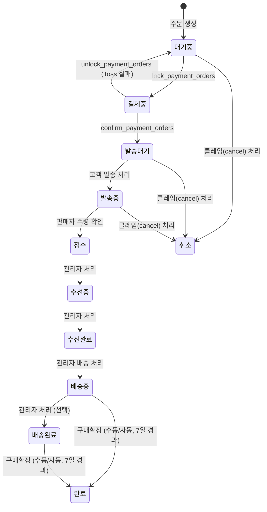

---
tags:
  - process
  - repair
---

# 수선 주문 프로세스 (Repair)

## 1. 개요

`repair` 타입 주문은 넥타이 수선 서비스를 신청하는 주문 흐름이다.
장바구니에 수선 아이템(`item_type: reform`)이 포함된 경우, `create_order_txn`에서 자동으로 별도 수선 주문으로 분리된다.
수선 주문은 `payment_group_id`로 일반 상품 주문과 묶여 함께 결제된다.

---

## 2. 상태값

| 상태       | 설명                                                  |
| ---------- | ----------------------------------------------------- |
| `대기중`   | 주문 생성 직후, 결제 대기                             |
| `결제중`   | Toss 결제 게이트웨이 호출 전 잠금 상태                |
| `발송대기` | 결제 완료 후, 고객이 수선물 발송 전 대기 **[미구현]** |
| `발송중`   | 고객이 수선물을 판매자에게 배송 중 **[미구현]**       |
| `접수`     | 판매자가 수선물 수령 완료, 수선 시작 대기             |
| `수선중`   | 수선 작업 진행 중                                     |
| `수선완료` | 수선 완료, 배송 준비                                  |
| `배송중`   | 배송 시작 (판매자 → 고객)                             |
| `배송완료` | 배송 완료, 구매확정 대기                              |
| `완료`     | 구매확정 완료                                         |
| `취소`     | 주문 취소                                             |

---

## 3. 순방향 상태 전이



> **[미구현]** `발송대기`, `발송중` 상태는 아직 구현되지 않았다. 현재는 `결제중 → 접수`로 직접 전이된다.

| 현재 상태  | 다음 상태  | 트리거                                                         |
| ---------- | ---------- | -------------------------------------------------------------- |
| `대기중`   | `결제중`   | `lock_payment_orders`                                          |
| `결제중`   | `발송대기` | `confirm_payment_orders` **[미구현: 현재 `접수`로 직접 전이]** |
| `결제중`   | `대기중`   | `unlock_payment_orders` (Toss 실패)                            |
| `발송대기` | `발송중`   | 고객 발송 처리 **[미구현]**                                    |
| `발송중`   | `접수`     | 판매자 수령 확인 **[미구현]**                                  |
| `접수`     | `수선중`   | 관리자 처리                                                    |
| `수선중`   | `수선완료` | 관리자 처리                                                    |
| `수선완료` | `배송중`   | 관리자 배송 처리                                               |
| `배송중`   | `배송완료` | 관리자 상태 변경 (선택적, 거의 사용 안 함)                     |
| `배송중`   | `완료`     | 구매확정 (수동) 또는 shipped_at 기준 7일 경과 (자동)           |
| `배송완료` | `완료`     | 구매확정 (수동) 또는 delivered_at 기준 7일 경과 (자동)         |

---

## 4. 롤백 전이

`is_rollback=true` + `memo`(사유) 필수. 오입력 정정 목적으로만 사용한다.

| 현재 상태  | 롤백 대상 | 조건                        |
| ---------- | --------- | --------------------------- |
| `접수`     | `대기중`  | is_rollback=true, memo 필수 |
| `수선중`   | `접수`    | is_rollback=true, memo 필수 |
| `수선완료` | `수선중`  | is_rollback=true, memo 필수 |

> **불가 상태**: `배송중`, `배송완료`, `완료`, `취소`는 이전 상태 복원 불가.

---

## 5. 혼합 장바구니 처리

장바구니에 `product` 아이템과 `reform` 아이템이 함께 있을 경우:

```text
create_order_txn
  ├─ product 아이템 → sale 타입 주문 생성
  └─ reform 아이템 → repair 타입 주문 생성 (별도 주문)

두 주문은 동일한 payment_group_id로 묶임
→ confirm-payment Edge Function에서 일괄 결제 처리
```

---

## 6. 수선 비용 구조

| 항목        | 상수명                 | 설명                                         |
| ----------- | ---------------------- | -------------------------------------------- |
| 기본 수선비 | `REFORM_BASE_COST`     | 수선 기본 비용                               |
| 수선 배송비 | `REFORM_SHIPPING_COST` | 수선 주문 전용 배송료 (일반 상품 주문은 0원) |

비용 값은 `public.custom_order_pricing_constants` 테이블에서 관리된다 (`REFORM_BASE_COST`, `REFORM_SHIPPING_COST` 키).

---

## 7. 취소 규칙

| 취소 가능 주문 상태 | 환불 규칙                                                                            |
| ------------------- | ------------------------------------------------------------------------------------ |
| `대기중`            | 결제 전이므로 즉시 취소. 전액 환불                                                   |
| `발송대기` [미구현] | 클레임(cancel) 생성 후 관리자 처리. 고객 미발송 확인 시 전액 환불                    |
| `발송중` [미구현]   | 클레임(cancel) 생성 후 관리자 처리. 반품 택배비(`REFORM_SHIPPING_COST`) 공제 후 환불 |

`접수` 이후 상태에서는 취소 불가.

자세한 내용은 [[claim-process]] 참조.

---

## 8. API 호출 흐름

### 수선 주문 생성 (혼합 장바구니)

```text
프론트 → Edge Function: create-order
  └─ 아이템 배열에 reform 타입 포함
  └─ item_type=reform 이면 reform_data 필수
  └─ RPC: create_order_txn
       ├─ product 아이템 → orders(sale) 생성
       ├─ reform 아이템 → orders(repair) 생성
       └─ 동일 payment_group_id 부여
  └─ 반환: { payment_group_id, total_amount, orders: [{sale주문}, {repair주문}] }
```

### 결제 (일반 주문과 동일)

```text
프론트 → Edge Function: confirm-payment
  └─ payment_group_id로 모든 주문(sale + repair) 일괄 처리
  └─ repair 주문: 결제중 → 접수
  └─ sale 주문: 결제중 → 진행중
```

---

## 9. 관련 파일

| 파일                                            | 역할                                         |
| ----------------------------------------------- | -------------------------------------------- |
| `supabase/schemas/93_functions_orders.sql`      | `create_order_txn` reform 분기 처리 포함     |
| `supabase/functions/create-order/index.ts`      | 주문 생성 Edge Function (reform 아이템 검증) |
| `supabase/functions/confirm-payment/index.ts`   | 결제 확정 Edge Function                      |
| `packages/shared/src/constants/order-status.ts` | 상태 상수 정의                               |
