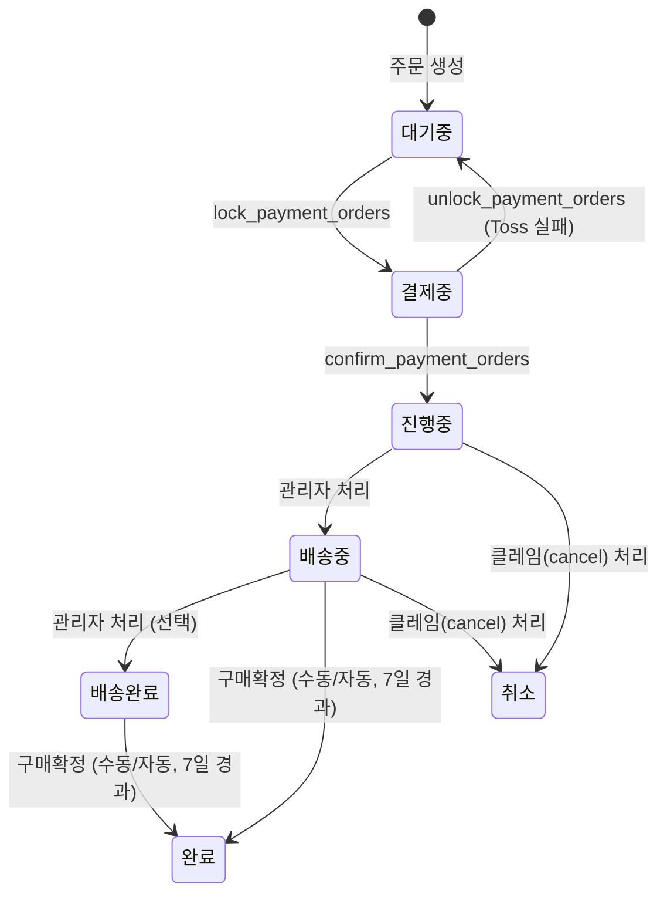

# 일반 상품 주문 프로세스 (Sale)

## 1. 개요

`sale` 타입 주문은 장바구니에 담긴 상품을 구매하는 일반 주문 흐름이다.
결제 완료 후 판매자가 배송을 처리하고, 고객이 구매를 확정하면 포인트가 적립된다.

---

## 2. 상태값

| 상태 | 설명 |
|------|------|
| `대기중` | 주문 생성 직후, 결제 대기 상태 |
| `결제중` | Toss 결제 게이트웨이 호출 전 원자적 잠금 상태 |
| `진행중` | 결제 확정 완료, 판매자 처리 대기 |
| `배송중` | 판매자가 배송 시작 |
| `배송완료` | 배송 완료, 구매확정 대기 |
| `완료` | 구매확정 완료 |
| `취소` | 주문 취소 (클레임 처리) |

---

## 3. 순방향 상태 전이



| 현재 상태 | 다음 상태 | 트리거 |
|---------|---------|-------|
| `대기중` | `결제중` | `lock_payment_orders` (service_role) |
| `결제중` | `진행중` | `confirm_payment_orders` (service_role) |
| `결제중` | `대기중` | `unlock_payment_orders` (Toss 실패 복구) |
| `진행중` | `배송중` | 관리자 상태 변경 |
| `배송중` | `배송완료` | 관리자 상태 변경 (선택적, 거의 사용 안 함) |
| `배송중` | `완료` | 구매확정 (수동) 또는 shipped_at 기준 7일 경과 (자동) |
| `배송완료` | `완료` | 구매확정 (수동) 또는 delivered_at 기준 7일 경과 (자동) |

---

## 4. 롤백 전이

`is_rollback=true` + `memo`(사유) 필수. 오입력 정정 목적으로만 사용한다.

| 현재 상태 | 롤백 대상 | 조건 |
|---------|---------|------|
| `진행중` | `대기중` | is_rollback=true, memo 필수 |

> **불가 상태**: `배송중`, `배송완료`, `완료`, `취소`는 is_rollback 여부와 무관하게 이전 상태 복원 불가.

---

## 5. 취소 규칙

| 취소 가능 주문 상태 | 비고 |
|----------------|------|
| `대기중` | 결제 전이므로 즉시 취소 |
| `결제중` | Toss 취소 처리 필요 |
| `진행중` | 클레임(cancel) 생성 후 관리자 처리 |

`배송중`, `배송완료`, `완료` 상태에서는 취소 불가. 반품(return) 또는 교환(exchange) 클레임만 가능.

자세한 내용은 [claim-process.md](./claim-process.md) 참조.

---

## 6. 구매확정

### 수동 확정
- 고객이 직접 확정 (`customer_confirm_purchase`)
- 허용 상태: `배송완료`, `배송중`
- 포인트 적립: 결제 금액의 **2%**
- 진행 중인 클레임이 없어야 함

### 자동 확정
- pg_cron 매일 03:00 KST 실행 (`auto_confirm_delivered_orders`)
- 두 조건을 **단일 쿼리**로 처리 (cron 1회 실행)
  - `배송완료` 상태에서 `delivered_at` 기준 7일 경과
  - `배송중` 상태에서 `shipped_at` 기준 7일 경과 (관리자가 `배송완료` 처리를 안 해도 자동 확정됨)
- 포인트 적립: 결제 금액의 **0.5%**
- 진행 중인 클레임이 없어야 함

포인트 정책 상세는 [../functions/point-policy.md](../functions/point-policy.md) 참조.

---

## 7. API 호출 흐름

### 주문 생성
```text
프론트 → Edge Function: create-order
  └─ 입력 검증 (item_type별 필수 필드 확인)
  └─ 배송지 소유권 검증
  └─ RPC: create_order_txn
       ├─ 재고 차감
       ├─ 쿠폰 예약 (active → reserved)
       └─ 주문 생성 (reform 아이템 있으면 별도 주문으로 분리)
  └─ 반환: { payment_group_id, total_amount, orders[] }
```

### 결제
```text
프론트 → Toss SDK 결제 UI
프론트 → Edge Function: confirm-payment
  └─ RPC: lock_payment_orders (대기중 → 결제중)
  └─ Toss API: /v1/payments/confirm
  └─ 성공: RPC: confirm_payment_orders (결제중 → 진행중)
  └─ 실패: RPC: unlock_payment_orders (결제중 → 대기중, 쿠폰 복원)
```

결제 정책 상세는 [../functions/payment-policy.md](../functions/payment-policy.md) 참조.

---

## 8. 관련 파일

| 파일 | 역할 |
|------|------|
| `supabase/schemas/93_functions_orders.sql` | 주문 RPC (create_order_txn, confirm_payment_orders 등) |
| `supabase/functions/create-order/index.ts` | 주문 생성 Edge Function |
| `supabase/functions/confirm-payment/index.ts` | 결제 확정 Edge Function |
| `packages/shared/src/constants/order-status.ts` | 상태 상수 정의 |
